# MH ↔ STM32 RTU SCP Arayüzü

| | |
|---|---|
| Belge | MH ↔ STM32 RTU SCP Arayüzü |
| Sürüm | R1 |
| Tarih | 05.10.2026 |
| Hazırlayan | BOLATeX |
| Firmware | MH ve AY `6dc02267` · PWRB `915bb945` |

**Gizlilik.** Bu belge BOLATeX'e aittir. Yalnız hazırlanış amacı doğrultusunda, bu projede kullanılabilir;
üçüncü kişi ve kurumlarla paylaşılamaz.

Belgedeki tablolar künyedeki firmware sürümlerinin anlık görüntüsüdür. Belge ile cihaz davranışı ayrışırsa ölçüt
cihazdır; ayrışmayı lütfen bildirin.

**Hazırlık notu:**
Güç kartı (PWRB) yazılımı saha denemelerine hazırdır. Ayırıcı (AY) ve Modem RF Hub (MH) yazılımları ileri geliştirme aşamasındadır; STM32 RTU arayüzüne yönelik ek talepler sonuçlandıkça MH yazılımında, gerektiğinde AY ve PWRB yazılımlarında da güncellemeler yapılacaktır. Havadan yazılım güncelleme (OTA) altyapısı geliştirilmiştir; Donanım Revizyon 2 ile etkinleştirilecektir. Etkinleştirme RTU tarafında da arayüz çalışması gerektirecektir.

**Yol haritası ve değişiklik bildirimi:**
Yol haritasındaki açık konular önümüzdeki dönemde sırasıyla giderilecektir. Her yeni firmware ayrıca bildirilecek ve bu bildirimlerde yalnız değişiklikler raporlanacaktır. Bu paketteki belgeler taban belgelerdir.

## Terimler ve Kısaltmalar

| Türkçe | İngilizce | Kısaltma |
|---|---|---|
| Ayırıcı | sectionalizer | AY |
| Modem RF Hub (CC1312 tabanlı RF düğümü) | modem RF hub | MH |
| Uzak terminal birimi (STM32 tabanlı, Troika kartı) | remote terminal unit | RTU |
| Güç kartı | power board | PWRB |
| Basit haberleşme protokolü | Simple Communication Protocol | SCP |
| Bayt doldurmalı çerçeveleme | Consistent Overhead Byte Stuffing | COBS |
| Döngüsel artıklık denetimi | cyclic redundancy check | CRC |
| Seri asenkron hat | universal asynchronous receiver-transmitter | UART |
| Radyo frekansı | radio frequency | RF |
| Cihazın değişmez 64 bit kimliği | extended unique identifier | EUI-64 |
| Alınan sinyal gücü göstergesi | received signal strength indicator | RSSI |
| IEC 60870-5 7 baytlık zaman damgası | — | CP56Time2a |
| Geçersiz biti / yaz saati biti | invalid / summer time | IV / SU |
| Etkin değer | root mean square | RMS |
| Sayı olmayan kayan nokta değeri | not a number | NaN |
| Fider | feeder | — |
| Bölge | zone | — |
| Envanter: RTU'nun MH'ye yüklediği EUI-64 → bölge, fider, faz eşlemesi | inventory | — |
| Keşif: envanterde olmayan ayırıcının MH tarafından duyulması | discovery | — |
| Açma | trip | — |
| Olay kaydı / olay deposu | event record / event store | — |
| Tüketme imleci: RTU'nun teslim aldığı son kaydın ötesi | consume cursor | `tail` |
| İstek dışı mesaj: MH'nin istenmeden gönderdiği bildirim | unsolicited notification | — |
| Yapılandırma (ayırıcının 96 baytlık ayar bloğu) / ayar (tek alan) | configuration / setting | — |
| Güç kartının ikinci ayar bloğu | configuration block 2 | CFG2 |
| Ayar kuşak numarası | generation | GEN |
| Yankı: güç kartının ayar bloğunu değerlendirme sonucu | echo | — |
| Son nefes: güç kartının enerji kaybı bildirimi | last gasp | — |
| Akü doluluk oranı / akü sağlığı | state of charge / state of health | SoC / SoH |
| Güneş paneli girişi / doğru akım girişi | photovoltaic / direct current | PV / DC |
| Akü kapasitesine göre akım oranı | C-rate | C |
| Aşırı gerilim koruması | overvoltage protection | OVP |
| Soğuk yük alma | cold load pickup | CLP |
| Bayt sırası: önce düşük / önce yüksek anlamlı bayt | little-endian / big-endian | — |
| — | header / payload | — |
| — | broadcast | — |
| — | watchdog | — |
| Havadan yazılım güncelleme | over-the-air update | OTA |

`ACK`, `ERROR`, `GET`, `SET`, `PING`, `SEQ`, `CMD`, `TYPE`, `LEN`, `DATA` SCP v1.0 alan ve değer adlarıdır;
belgede aynen kullanılır.

## 1. Akışlar

Bu bölüm her işin mesaj sırasını verir. Bayt düzenleri, hata kodları ve kurallar sonraki bölümlerdedir; her
akışın sonunda ilgili bölüm belirtilir. Diyagramlarda AY ↔ MH ve PWRB ↔ MH okları RTU'nun görmediği iç
bağlantılardır; RTU yalnız MH ↔ RTU oklarını görür. Kesik ok yanıtı gösterir. RTU'nun kendi iç işleri
"Önerilen" notuyla gösterilir; bunlar RTU tasarımına bırakılmış önerilerdir.

### 1.1 MH açılışı ve envanter yükleme

MH açıldıktan yaklaşık 1 s sonra `0x13` BOOT_NOTIFY gönderir ve envanter gelene kadar artan aralıklarla yineler
(aralık en çok 30 s). RTU'nun önce saati, ardından her ayırıcı için bir envanter girdisini,
en sonda envanter sonunu göndermesi önerilir. MH envanteri yalnız çalışma belleğinde tutar; bu sıra MH her açıldığında
yinelenir. Envanter yüklenene kadar MH ayırıcıların olay kayıtlarını kabul etmez; kayıtlar ayırıcıda bekler.

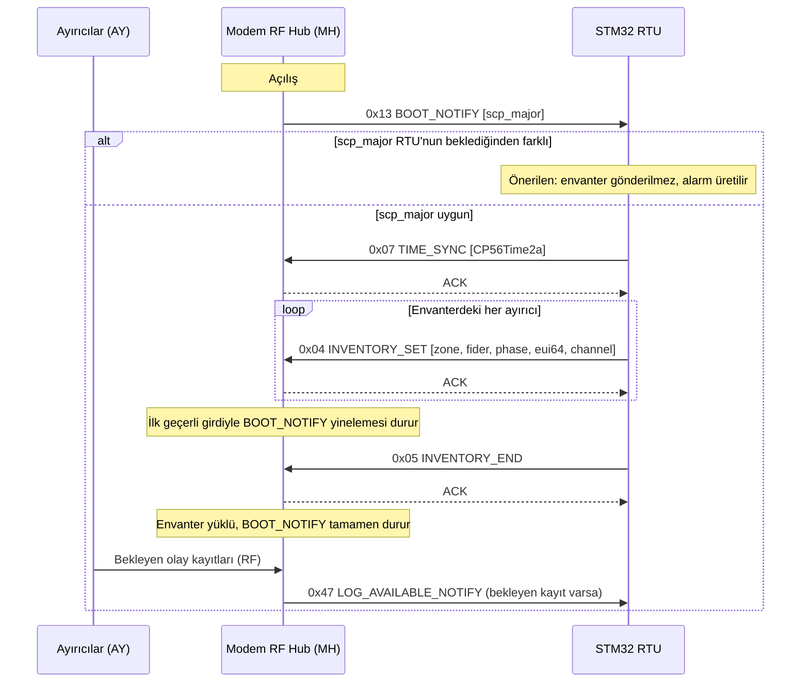

Envanter girdileri arasında ve son girdiden `0x05`'e kadar 10 s'den uzun ara verilmez; aksi durumda BOOT_NOTIFY
yeniden başlar. Boş
envanterle gelen `0x05` `ACK` alır ama envanter yüklü sayılmaz ve BOOT_NOTIFY sürer.
Ayrıntı: §4.3, §4.4.

### 1.2 Keşif ve yeni ayırıcının katılması

Envanterde olmayan bir ayırıcı RF'te duyulduğunda MH bunu `0x14` DISCOVERY_REPORT ile bildirir. RTU ayırıcıyı
envantere eklemeye karar verirse `0x06` INVENTORY_UPDATE gönderir. Ayırıcı bölge, fider ve faz bilgisini MH'den
RF ile alır; ayırıcıda elle ayar gerekmez. Atama ayırıcının olay kaydında olay 120 olarak görünür.

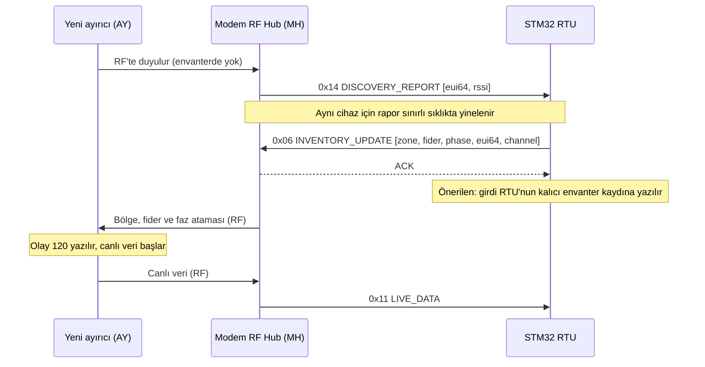

Envanterden silmek için `0x06` `fider = 0` ile gönderilir. Envantere eklenen ya da envanterden silinen cihazın
rapor sıklık sınırı sıfırlanır; cihaz yeniden duyulduğunda hemen raporlanır.
Ayrıntı: §4.3.

### 1.3 Açma (TRIP) bildirimi

Açma bildirimi yalnız üç faz birlikte açma kipinde (`Trip_Mode` = 1) ve fider atanmış ayırıcıda üretilir.
Bildirimi açmayı başlatan ayırıcı gönderir; aynı fiderin diğer iki fazı RF açma isteğiyle açar ve bu açma kendi
olay kayıtlarında olay 7 olarak görünür. MH aynı açmayı RTU'ya bir kez iletir.
Bildirim kaybolabilir; kayıpsız yol olay kaydıdır. Bağımsız kipte (`Trip_Mode` = 0) açma RTU'ya yalnız olay
kaydıyla ulaşır.

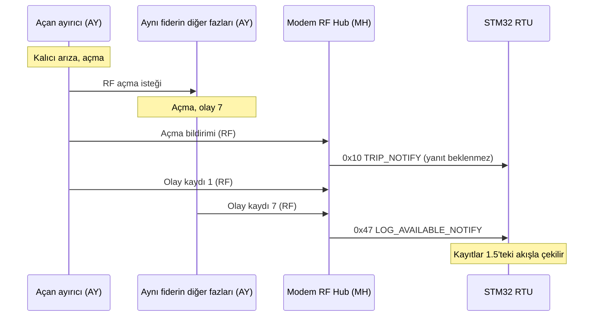

Açma bildirimindeki `max_fault_current` açma anındaki anlık akımdır; arıza akımının büyüklüğü ve olay zamanı
olay kaydındadır.
Ayrıntı: §4.5, §4.7, §4.8.

### 1.4 Canlı veri

Her ayırıcı canlı ölçümünü periyodik olarak MH'ye gönderir; MH her birini `0x11` LIVE_DATA olarak iletir. Aralık
tipik 5 s'dir; ayırıcı olay kaydı aktarırken 10 s'ye çıkar. Kesinti eşiği olarak en az üç periyot (≥ 30 s)
önerilir. RF katmanında kimliği doğrulanamayan çerçeveler `0x12` ANOMALY_REPORT ile yalnız bilgi amaçlı bildirilir.

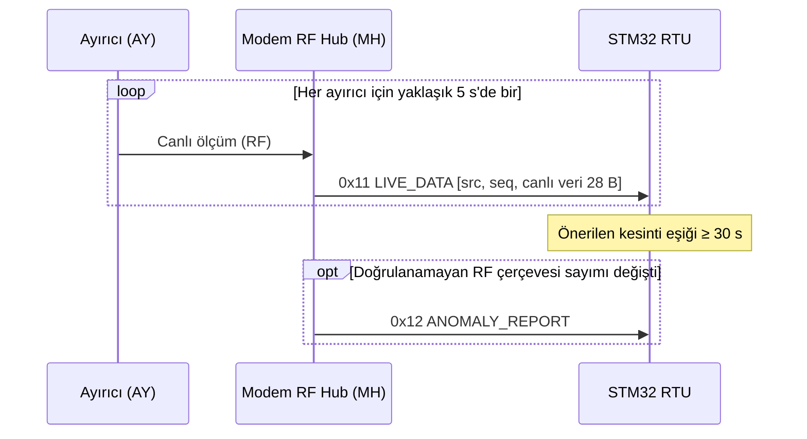

Ayrıntı: §4.1 (kaynak baytı `src`), §4.5.

### 1.5 Olay kaydı çekme

MH ayırıcılardan gelen olay kayıtlarını 100 yuvalı kalıcı bir halkada tutar. Tüketilmemiş kayıt sayısı 0'dan 1'e
çıktığında `0x47` gider; kayıt beklemeye devam ettikçe en geç 60 s'de bir yinelenir. RTU kayıtları
çeker, merkeze aktarır ve aldığını `0x46` ile bildirir. Bildirilmeyen kayıt silinmez; halka dolarsa en eski kayıt
üzerine yazılır.

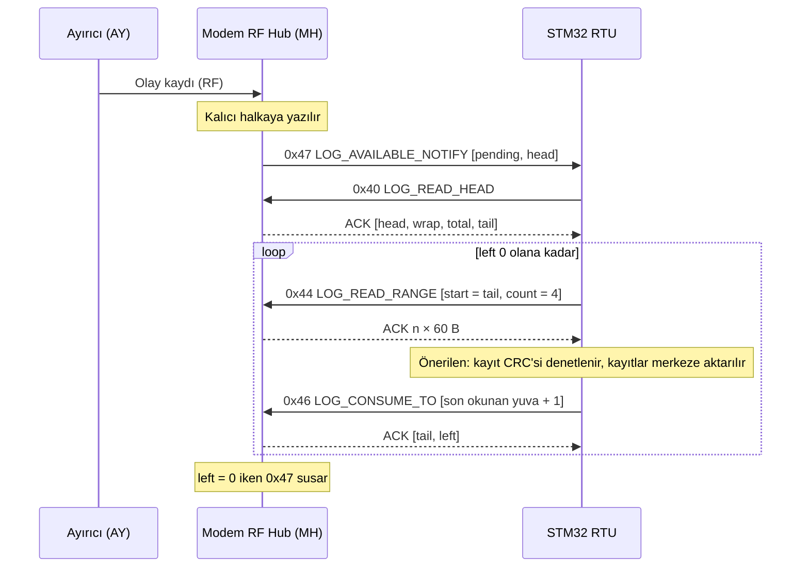

Yanıt `ERROR 0x06` ise yuva atlanır ve `0x46` ile imleç yuvanın ötesine taşınır. Yanıt `ERROR 0x03` ise yeni
`SEQ` ile kısa süre sonra yinelenir. `0x47` kaybolabilir; RTU periyodik `0x40` ile de denetler.

**Öneri:** `0x47` geldiğinde RTU'nun kayıtları hemen çekmesi önerilir (`0x40` → `0x44` → `0x46`). Üç faz
kipinde (`Trip_Mode` = 1) açma alarmı `0x10` TRIP_NOTIFY'a dayandırılabilir: açma anı RTU'ya hemen ulaşır. Tek faz
kipinde (`Trip_Mode` = 0) `0x10` gönderilmez; açma olay kaydıyla görülür. Her iki kipte ayrıntılı olay kayıtları
dakikalar içinde gelir (tek bir açma için tipik olarak 10–15 dk).

Ayrıntı: §4.6, §4.7.

### 1.6 Ayırıcı yapılandırması: okuma, yazma, uygulama

Yapılandırma bir fiderin üç ayırıcısına tek grup işlemi olarak gönderilir ve sonuç grup için tek durumla
bildirilir. Üç ayırıcı da uyguladığında durum APPLIED olur. FAILED `sebep` 6'da yapılandırma ayırıcıların bir
kısmında uygulanmış olabilir; RTU bu durumda `0x28` ile her üyenin durumunu doğrular (§4.9). Bu sürümde
yürürlükteki yapılandırma okunamaz (`0x20` daima `ERROR 0x05`); RTU'nun bloğu kendi kalıcı kaydından üretmesi
önerilir.

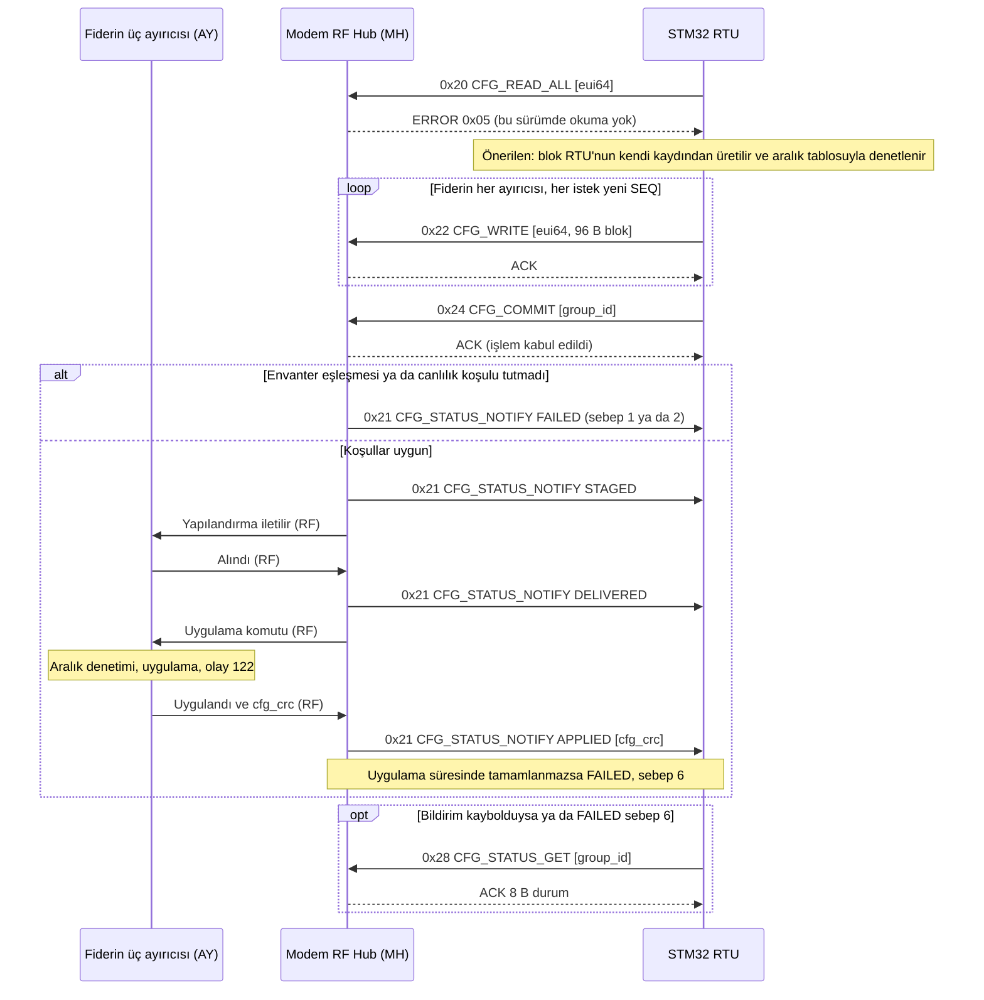

İşlemden vazgeçmek için `0x26` CFG_ABORT gönderilir; sonuç FAILED, sebep 10 (USER_ABORT) olarak görünür.

MH kartı değiştirildiyse, o fidere yapılandırma göndermeden önce `0x2A` EPOCH_REFRESH çağrılır; ardından
yaklaşık 30 s beklenmesi önerilir:

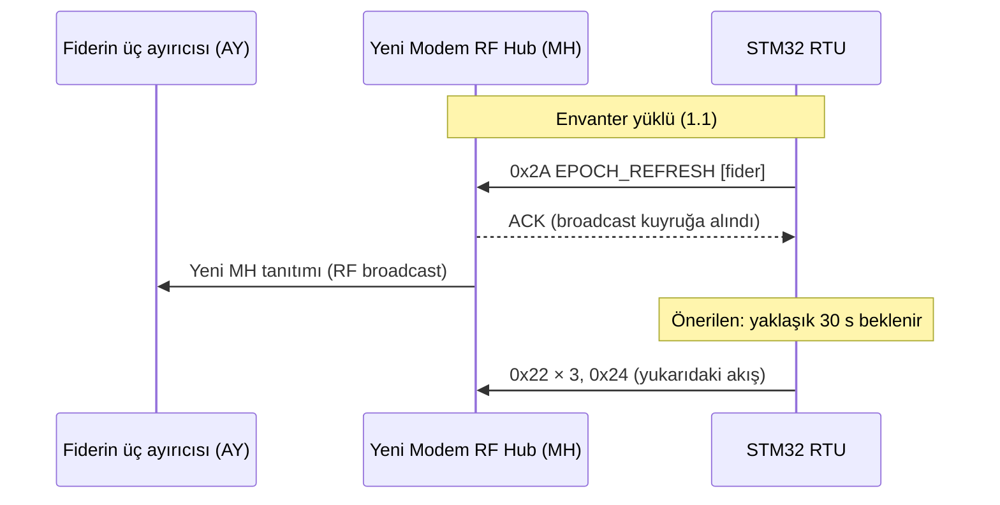

Ayrıntı: §4.3 (`0x2A`), §4.9, §4.10.

### 1.7 Zaman eşitleme

RTU'nun saati BOOT_NOTIFY görünce ve sonrasında periyodik olarak göndermesi önerilir; önerilen tazeleme aralığı
1 saattir.
Gönderilen saat yerel saattir (Türkiye, UTC+3). MH saati kalıcı belleğe yazmaz. Ayırıcı saati MH üzerinden alır;
olay kaydındaki `clock_quality` alanı saatin o anki durumunu gösterir.

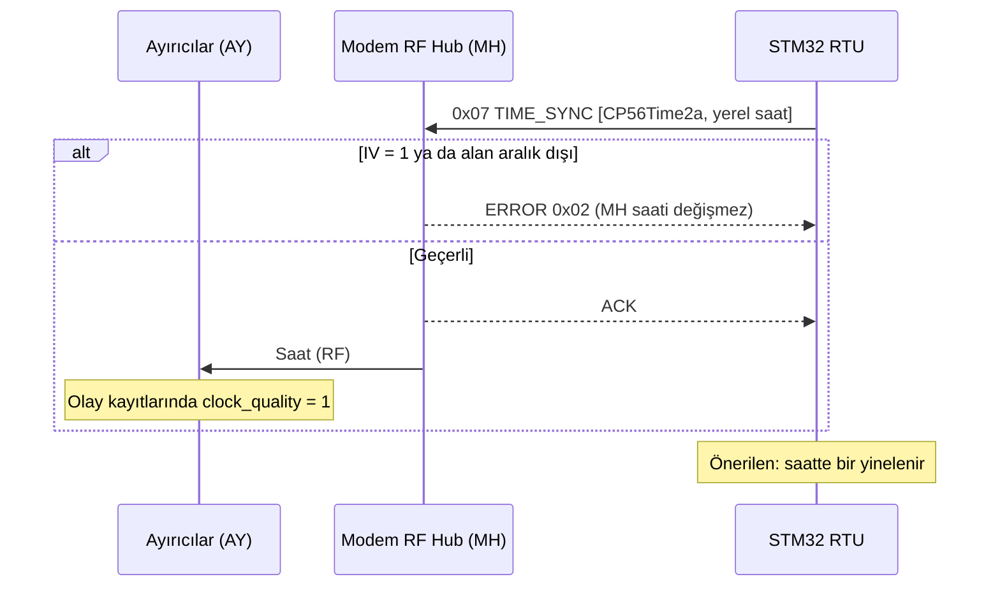

Ayrıntı: §4.1 (zaman damgası), §4.4.

### 1.8 Güç kartı özeti ve alarmı

Güç kartı telemetrisini periyodik olarak MH'ye gönderir (periyot 1–10 s, `0xE5` ayarı). MH bu telemetriden
`0xE1` güç özetini üretir ve alarm değişimlerini `0xE3` ile bildirir. İkisi de yanıt beklemez.

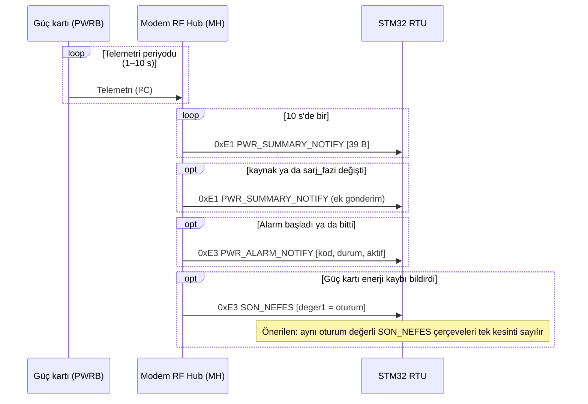

Alarm geçmişini RTU tutar; MH alarmları saklamaz. Seviye alarmlarının güncel durumu en geç 10 s içinde `0xE1`
`alarm_aktif` alanıyla da ulaşır.
Ayrıntı: §5.2, §5.3.

### 1.9 Güç kartı ayarı ve komutu (`0xE5`, `0xE6`, `0xE7`)

Ayar yazımı karşılaştırarak yazmadır: RTU önce okur, okuduğu GEN değeriyle yazar. MH bloğu kalıcı belleğine yazar
ve güç kartına iletir; güç kartı bloğu değerlendirip yankı döndürür. Komut tek seferliktir; sonucu `0xE7` ile
gelir.

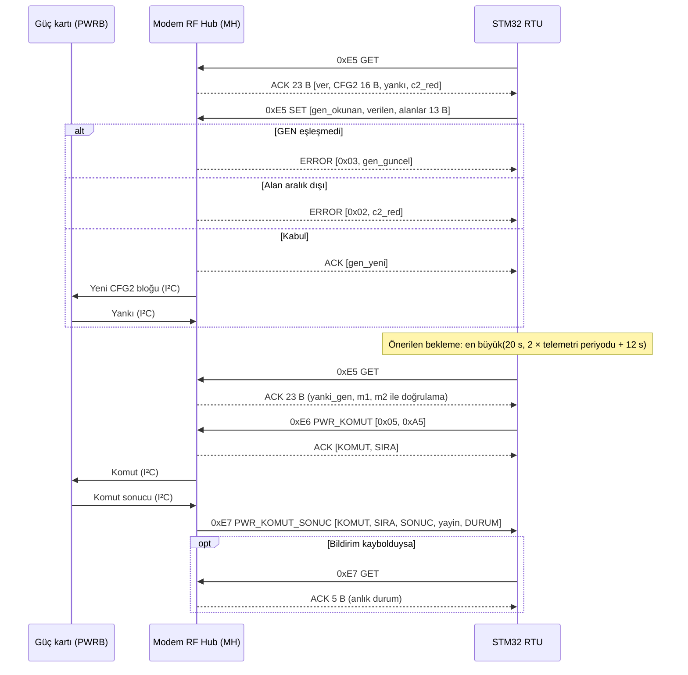

Kapasite değişikliği ile akü değişti komutu birlikte gerekiyorsa önce `0xE5` ile kapasite yazılır; `0x05` bu
yazımın güç kartında uygulandığı doğrulandıktan sonra gönderilir.
Ayrıntı: §5.4, §5.5, §5.6.

### 1.10 MH yeniden başladığında RTU'nun yapacakları

MH yeniden başladığında envanter, duvar saati ve sürmekte olan yapılandırma işlemi kaybolur. Olay deposu ve
tüketme imleci kalıcı bellektedir; etkilenmez. MH açılışta üç bildirim gönderir: BOOT_NOTIFY (yinelemeli),
anomali sıfırlaması ve güç alarmı sıfırlaması. RTU bu üç bildirimin birbirine göre sırasına dayanmaz; her
birini geldiği anda işler.

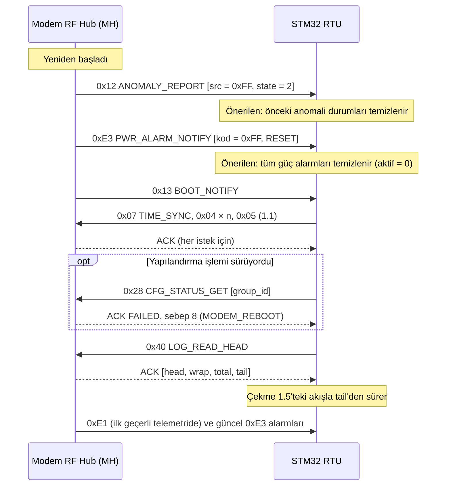

Ayrıntı: §6.3.

## 2. Taşıma kuralları

SCP v1.0'ın yetkili tanımı SCP v1.0 belirtimidir. Bu bölüm MH'nin uyguladığı çerçeve
kurallarını özetler; çelişkide belirtim geçerlidir.

### 2.1 Hat ve çerçeve

| Konu | Kural |
|---|---|
| Hat | İç UART, 230400 bit/s, 8 veri biti, eşliksiz, 1 dur biti (8N1) |
| Fiziksel çerçeve | `0x00` (çerçeve başı) + COBS ile kodlanmış paket + `0x00` (çerçeve sonu) |
| Mantıksal paket | `DST` · `SRC` · `TYPE` · `CMD` · `SEQ` · `LEN` · `~LEN` · `DATA` (0..244 B) · `CRC-16` (2 B) |
| `SEQ` | Yeni istekte +1, `0xFF`'ten sonra `0x00` |
| `~LEN` | `LEN`'in bit düzeyinde tersi (`LEN + ~LEN = 0xFF`) |
| Sınırlar | En büyük payload 244 B · en büyük mantıksal paket 253 B · en büyük fiziksel çerçeve 256 B |
| Bayt sırası | Çok baytlı alanlar little-endian. İstisnalar: `0xE5` CFG2 bloğunun bayt 11–12'si ve `0xE8` ham bloğunun içeriği big-endian'dır (güç kartının kendi biçimi) |

**CRC-16:**

| Parametre | Değer |
|---|---|
| Model | CRC-16/CCITT-FALSE |
| Polinom | `0x1021` |
| Başlangıç değeri | `0xFFFF` |
| Yansıtma (giriş / çıkış) | yok / yok |
| Son XOR | `0x0000` |
| Kapsam | `DST` + `SRC` + `TYPE` + `CMD` + `SEQ` + `LEN` + `~LEN` + `DATA` |
| Telde sıra | little-endian |
| Doğrulama vektörü | `05 01 02 10 01 02 FD AA BB` → `0x5035` (telde `35 50`) |

**`TYPE` değerleri:**

| Değer | Ad | Anlam |
|---|---|---|
| `0x01` | GET | Okuma isteği |
| `0x02` | SET | Yazma isteği ya da MH'nin istek dışı bildirimi |
| `0x03` | ACK | Başarılı yanıt |
| `0x04` | ERROR | Hata yanıtı; `DATA[0]` hata kodu (§6.1) |
| `0x05` | PING | Canlılık testi; boş `ACK` ile yanıtlanır |

`0x00` ve `0x06–0xFF` bu sistemde kullanılmaz; MH `ERROR 0x01` döner.

### 2.2 Adresler ve yanıt

| Konu | Kural |
|---|---|
| Adres | MH `0x01`, STM32 RTU `0x02`. RTU'nun her isteği `DST=0x01`, `SRC=0x02`; MH'nin bildirimleri `DST=0x02`, `SRC=0x01` |
| Broadcast | `DST=0x00` isteğini MH işler ama yanıt vermez. `SRC=0x00` ya da `0xFF` olan çerçeve sessizce atılır |
| Doğrulama | Bozuk COBS, `LEN`/`~LEN` uyuşmazlığı, uzunluk hatası ve CRC hatası olan çerçeveye yanıt üretilmez |
| Yarım çerçeve | MH, 100 ms bayt boşluğunda yarım SCP çerçevesini atar |
| Yanıt | MH her isteğe (broadcast hariç) `ACK` ya da `ERROR` döner; yanıtta `DST` ile `SRC` yer değiştirir, `CMD` ve `SEQ` isteğinkiyle aynıdır |
| Konsol metni | Aynı hatta MH'nin servis konsolu metni de gelir (açılış satırları ve olay satırları; Kullanım ve Ayar Kitapçığı, MH bölümü). RTU ayrıştırıcısı çerçeveler arasındaki metni yok sayar |
| İstek dışı mesajlar | `TYPE=SET` taşır ve yanıt beklemez. RTU bunlara yanıt göndermez |
| Bilinmeyen | Bilinmeyen `CMD` ya da `TYPE` → `ERROR 0x01` |
| Yineleme | SCP'de otomatik yeniden iletim yoktur. İstek yönünde zaman aşımı ve yineleme RTU'nun sorumluluğundadır (§6.2) |

### 2.3 Tekrarlanan istek (aynı `SRC` + `SEQ`)

- `GET` ve `PING` tekrarı yeniden işlenir (taze veri döner).
- `SET` tekrarı, araya başka bir istek girmeden aynı `SEQ` ile gelirse yeniden uygulanmaz; ilk yanıt aynen
  tekrarlanır. Araya başka bir istek girerse tekrar
  yeni istek gibi işlenebilir.
- `0x46` için özel durum: `ERROR 0x03` yanıtı önbelleğe alınmaz; tekrar her zaman yeniden işlenir.
- Her **yeni** istek yeni `SEQ` taşır. Aynı `SEQ`, yalnız yanıtsız kalan bir isteğin yinelemesinde kullanılır
  (Teslim #3 raporu §3.3 ile aynı kural).

## 3. Komut haritası

Yön sütununda "RTU→MH" istek, "MH→RTU" istek dışı bildirimdir. Uzunluklar `DATA` alanının bayt sayısıdır.

| CMD | Ad | Yön | TYPE | İstek | Yanıt | Bölüm |
|---|---|---|---|---|---|---|
| — | PING | RTU→MH | `0x05` | 0 B, `CMD=0x00` | Boş `ACK` | §4.2 |
| `0x01` | GET_STATUS | RTU→MH | GET | 0 B | `ACK` 25 B | §4.2 |
| `0x02` | GET_FRAM_STATS | RTU→MH | GET | 0 B | `ACK` 8 B | §4.2 |
| `0x03` | SET_CONFIG | RTU→MH | SET | — | Daima `ERROR 0x04` | §4.2 |
| `0x04` | INVENTORY_SET | RTU→MH | SET | 12 B | Boş `ACK` | §4.3 |
| `0x05` | INVENTORY_END | RTU→MH | SET | 0 B | Boş `ACK` | §4.3 |
| `0x06` | INVENTORY_UPDATE | RTU→MH | SET | 12 B | Boş `ACK` | §4.3 |
| `0x07` | TIME_SYNC | RTU→MH | SET | 7 B | Boş `ACK` | §4.4 |
| `0x10` | TRIP_NOTIFY | MH→RTU | SET | 12 B | — | §4.5 |
| `0x11` | LIVE_DATA | MH→RTU | SET | 33 B | — | §4.5 |
| `0x12` | ANOMALY_REPORT | MH→RTU | SET | 10 B | — | §4.5 |
| `0x13` | BOOT_NOTIFY | MH→RTU | SET | 1 B | — | §4.3 |
| `0x14` | DISCOVERY_REPORT | MH→RTU | SET | 9 B | — | §4.3 |
| `0x20` | CFG_READ_ALL | RTU→MH | GET | 8 B | Bu sürümde daima `ERROR 0x05` | §4.9 |
| `0x21` | CFG_STATUS_NOTIFY | MH→RTU | SET | 8 B | — | §4.9 |
| `0x22` | CFG_WRITE | RTU→MH | SET | 104 B | Boş `ACK` | §4.9 |
| `0x24` | CFG_COMMIT | RTU→MH | SET | 1 B | Boş `ACK` | §4.9 |
| `0x26` | CFG_ABORT | RTU→MH | SET | 1 B | Boş `ACK` | §4.9 |
| `0x28` | CFG_STATUS_GET | RTU→MH | GET | 1 B | `ACK` 8 B | §4.9 |
| `0x2A` | EPOCH_REFRESH | RTU→MH | SET | 1 B | Boş `ACK` | §4.3 |
| `0x40` | LOG_READ_HEAD | RTU→MH | GET | 0 B | `ACK` 10 B | §4.6 |
| `0x42` | LOG_READ_RECORD | RTU→MH | GET | 2 B | `ACK` 60 B | §4.6 |
| `0x44` | LOG_READ_RANGE | RTU→MH | GET | 4 B | `ACK` n × 60 B | §4.6 |
| `0x46` | LOG_CONSUME_TO | RTU→MH | SET | 2 B | `ACK` 4 B | §4.6 |
| `0x47` | LOG_AVAILABLE_NOTIFY | MH→RTU | SET | 4 B | — | §4.6 |
| `0xE1` | PWR_SUMMARY_NOTIFY | MH→RTU | SET | 39 B | — | §5.2 |
| `0xE3` | PWR_ALARM_NOTIFY | MH→RTU | SET | 11 B | — | §5.3 |
| `0xE5` | PWR_CFG2 | RTU→MH | GET / SET | 0 B / 16 B | `ACK` 23 B / `ACK` 1 B | §5.4 |
| `0xE6` | PWR_KOMUT | RTU→MH | SET | 2 B | `ACK` 2 B | §5.5 |
| `0xE7` | PWR_KOMUT_SONUC | MH→RTU ve RTU→MH | SET (MH→RTU) / GET | 5 B / 0 B | — / `ACK` 5 B | §5.6 |
| `0xE8` | PWR_TLM_UZUN | RTU→MH | GET | 0 B | `ACK` 96 B | §5.7 |

**Ayrılmış bantlar:** `0x08–0x0F`, `0x15–0x1F`, `0x2C–0x3F`, `0x48–0x5F`, `0x60–0xBF`, `0xC0–0xDF` (OTA
ailesi, planlanan), `0xE0`, `0xE2`, `0xE4`, `0xE9–0xEF`. Bu bantlarda tanımlı komut yoktur; MH
`ERROR 0x01` döner.

0xF0–0xFF üretici bandıdır; RTU bu komutları kullanmaz, gelen çerçeveyi yok sayar.

## 4. Komut ayrıntıları ve ayırıcı veri içeriği

### 4.1 Ayırıcı verisinin ortak kuralları

**Kodlama:**

| Konu | Kural |
|---|---|
| Bayt sırası | Tüm çok baytlı sayısal alanlar little-endian |
| Hizalama | Yapılar paketlidir; alanlar arasında dolgu yoktur |
| `float32` | IEEE-754 tek duyarlık, little-endian |
| `bool` | 1 bayt; 0 ya da 1 |
| EUI-64 | 8 ham bayt, en anlamlı bayt önce (etiketteki sırayla); sayı değil bayt dizisidir |
| Ayrılmış baytlar | Gönderirken 0; alırken yok sayılır |

**Kaynak baytı (`src`).** Canlı veri ve anomali bildirimlerindeki `src` baytı ayırıcının fider ve fazını taşır:

```
src   = (Fider_ID << 2) | Phase_ID
fider = (src >> 2) & 0x07
faz   = src & 0x03
```

Fider alanı 3 bittir; `0x03` ile maskelenirse fider 4–7 yanlış çözülür. `src` kimlik değildir: ayırıcının
kalıcı kimliği EUI-64'tür ve envanterde fider/faz ile eşleşir. Fider atanmamış (`Fider_ID` = 0) ayırıcı canlı veri
göndermez.

**Bölge, fider ve faz değerleri:**

| Alan | Değerler |
|---|---|
| Bölge (`Zone_ID`) | 0..7; 0 = bilinmiyor |
| Fider (`Fider_ID`, olay kaydında `Line_ID`) | 1..4 bu sürümde RF hizmetindeki fiderler; 5..7 ayrılmış; 0 = atanmamış ya da bilinmiyor |
| Faz (`Phase_ID`) | 1 = L1, 2 = L2, 3 = L3 |

**Zaman damgası.** Olay kaydının ilk 7 baytı CP56Time2a biçimindedir; bit düzeni §4.4 ile aynıdır.

| Konu | Kural |
|---|---|
| Saat ölçeği | RTU'nun `TIME_SYNC` ile gönderdiği saat (yerel saat). Ayırıcı saati MH üzerinden alır ve saat dilimi dönüşümü yapmaz |
| IV ve SU bitleri | Ayırıcı kayıtlarında daima 0 |
| Saatin geçerliliği | `clock_quality` alanında (ofset 55): 0 = geçersiz, 1 = eşitlenmiş, 2 = serbest çalışıyor (eşitleme kayboldu, yerel saatle sürüyor) |
| Saat geçersizken | Damga anlamlı bir tarih göstermez; milisaniye kısmı 0'dır |
| Sıralama | Damgadan bağımsız sıralama için `boot_counter` (ofset 49) ve `uptime_sec` (ofset 51) birlikte kullanılır: aynı `boot_counter` içinde `uptime_sec` monoton artar |

RTU'nun merkeze aktarımında IV biti için 21.08 arayüz paketinde kararlaştırılan kural geçerlidir:
`clock_quality` = 1 ise IV = 0; 0 ya da 2 ise IV = 1. Kaydın kendisi saat geçersiz olsa da geçerlidir.

### 4.2 Sistem

**PING (`TYPE 0x05`).** `CMD=0x00`, `LEN=0`. MH boş `ACK` döner; `CMD` ve `SEQ` aynen kopyalanır. Broadcast adresine
gönderilen PING yanıtlanmaz.

**`0x01` GET_STATUS → `ACK` 25 B**

| Ofset | Boy | Alan | Tip | Anlam |
|---|---|---|---|---|
| 0 | 4 | `uptime_sec` | u32 | MH açık kalma süresi, s |
| 4 | 16 | `fw_version` | char[16] | Firmware sürüm kimliği, ASCII (bu pakette künyedeki MH kimliği); en çok 15 karakter, ofset 19 daima `0x00` |
| 20 | 1 | `sched_active` | u8 | RF çevrimi çalışıyor: 1, çalışmıyor: 0 |
| 21 | 4 | `sched_cycle_count` | u32 | Açılıştan bu yana tamamlanan RF çevrimi sayısı |

`fw_version` alanının uzunluğu sabittir; içeriği ileride `Vx.y.z+kimlik` biçimine geçebilir (§8).

**`0x02` GET_FRAM_STATS → `ACK` 8 B**

| Ofset | Boy | Alan | Tip | Anlam |
|---|---|---|---|---|
| 0 | 2 | `head_index` | u16 | Olay deposunda bir sonraki yazılacak yuva |
| 2 | 2 | `wrap_count` | u16 | Deponun kaç kez sardığı |
| 4 | 2 | `free_slots` | u16 | Yaklaşık değer; bozulmuş kipte 0 |
| 6 | 1 | `degraded` | u8 | 1 = kalıcı bellek bozulmuş kipte |
| 7 | 1 | — | u8 | `0x00` |

`degraded = 1` iken ofset 0–5 güvenilir değildir; yanıt yalnız ofset 6 ile yorumlanır. Kalıcı belleğe o an
erişilemiyorsa `ERROR 0x03` döner.

**`0x03` SET_CONFIG.** Kullanılmaz; daima `ERROR 0x04`. Ayırıcı yapılandırması `0x20` ailesiyle yapılır (§4.9).

### 4.3 Açılış, envanter ve keşif

**`0x13` BOOT_NOTIFY (MH→RTU) — 1 B**

| Ofset | Alan | Anlam |
|---|---|---|
| 0 | `scp_major` | SCP ana sürümü; bugün `1` |

MH açıldıktan yaklaşık 1 s sonra ilk BOOT_NOTIFY'ı gönderir ve envanter gelene kadar artan aralıklarla yineler
(aralık en çok 30 s). Her yineleme yeni `SEQ` taşır.

- İlk geçerli `0x04`/`0x06` geldiğinde yineleme durur ve MH `0x05` INVENTORY_END'i bekler. 10 s içinde yeni bir
  girdi ya da END gelmezse BOOT_NOTIFY yeniden başlar.
- END geldiğinde BOOT_NOTIFY tamamen durur. Sonraki `0x06` güncellemeleri onu yeniden başlatmaz.
- `scp_major` RTU'nun beklediğinden farklıysa RTU'nun envanteri göndermeden alarm üretmesi önerilir.

**Önerilen açılış sırası (RTU):** BOOT_NOTIFY görülünce önce `0x07` TIME_SYNC, ardından her ayırıcı için `0x04`
INVENTORY_SET, en sonda bir kez `0x05` INVENTORY_END (§1.1).

**`0x04` INVENTORY_SET ve `0x06` INVENTORY_UPDATE — 12 B**

| Ofset | Boy | Alan | Anlam |
|---|---|---|---|
| 0 | 1 | `zone` | Bölge kimliği, 0..7 (0 kabul edilir, "bilinmiyor" anlamındadır; 8 ve üstü `ERROR 0x02`). MH açıldıktan sonraki ilk geçerli girdi MH'nin bölgesini belirler; sonraki girdiler aynı bölgeyi taşımalıdır. Bölge kalıcı değildir: bölgeyi değiştirmek için MH yeniden başlatılır ve envanter yeni bölgeyle yüklenir |
| 1 | 1 | `fider` | 1..7 kabul edilir; bu sürümde RF hizmeti fider 1–4 içindir (`0x06`'da 0 = silme, aşağıda) |
| 2 | 1 | `phase` | 1..3 |
| 3 | 8 | `eui64` | Ayırıcının EUI-64 kimliği, en anlamlı bayt önce (etiketteki sırayla) |
| 11 | 1 | `channel` | Kabul edilir, yalnız bilgi amaçlı saklanır; RF haberleşmesi için fider ataması zorunludur |

- Kapasite 21 girdidir (7 fider × 3 faz).
- Envanter yüklenmeden MH ayırıcıların olay kayıtlarını kabul etmez (kayıt ayırıcıda bekler). Yeni bir ayırıcı
  eklemek için `0x06` (ya da `0x04` + `0x05`) yeterlidir; ayırıcı fider/faz bilgisini MH'den RF ile alır, ayırıcıda
  elle ayar gerekmez.
- RTU envanteri kendi kalıcı kaydında tutar ve her BOOT_NOTIFY'da yeniden gönderir. Yalnız `0x06` ile yapılan
  yükleme envanteri "yüklü" yapmaz; tam yükleme `0x05` ile biter.
- Aynı EUI-64 yeniden yazılırsa girdisi güncellenir. Aynı fider ve faza farklı EUI-64 yazılırsa son yazılan geçerlidir.
- **Silme:** `0x06` ile `fider = 0` gönderilirse o EUI-64 envanterden silinir. Kayıt yoksa da boş `ACK` döner.
  `0x04` ile `fider = 0` → `ERROR 0x02`.
- Aralık dışı değer, bölge uyuşmazlığı ya da uzunluk hatası → `ERROR 0x02`.

**`0x05` INVENTORY_END — 0 B.** Envanterin tamamlandığını bildirir. Envanterde hiç girdi yoksa END `ACK` alır ama
envanter "yüklü" sayılmaz ve BOOT_NOTIFY sürer. Boş olmayan gövde → `ERROR 0x02`.

**`0x14` DISCOVERY_REPORT (MH→RTU) — 9 B**

| Ofset | Boy | Alan | Anlam |
|---|---|---|---|
| 0 | 8 | `eui64` | Envanterde olmayan ayırıcının kimliği, en anlamlı bayt önce |
| 8 | 1 | `rssi` | Alınan sinyal düzeyi, i8, dBm |

Yalnız envanterde olmayan ayırıcılar bildirilir; aynı cihaz için rapor sınırlı sıklıkta yinelenir. Envantere
eklenen ya da envanterden silinen bir cihazın sıklık sınırı sıfırlanır; cihaz yeniden duyulduğunda hemen raporlanır.

**`0x2A` EPOCH_REFRESH — 1 B `[fider]`.** MH kartı değiştirildiğinde kullanılır: MH, verilen fiderin üç
ayırıcısına yeni MH'yi RF broadcast ile tanıtır. MH broadcast'i yaklaşık 15 s içinde üç kez gönderir;
yapılandırmadan önce yaklaşık 30 s beklenmesi önerilir. Envanter yüklendikten **sonra** çağrılır.
Boş `ACK`, broadcast'in kuyruğa alındığını gösterir; ayırıcıya ulaştığının güvencesi değildir. Önceki broadcast ya da bir
yapılandırma işlemi sürerken çağrı → `ERROR 0x03`; fider 1–4 dışında ya da MH'de ağ anahtarı yüklü değilse →
`ERROR 0x02`. Servis konsolundaki karşılığı `epoch_refresh <fider>`'dır.

> **Önemli:** MH kartı değiştirildikten sonra, o fidere yapılandırma (`0x22`/`0x24`) göndermeden önce
> `0x2A` mutlaka çağrılır. Çağrılmazsa ayırıcılar yeni MH'den gelen yapılandırmayı doğrulayamaz ve reddeder.
> Canlı veri (`0x11`) ve olaylar etkilenmez, bu yüzden durum kendiliğinden fark edilmez; RTU yalnız
> `0x21` CFG_STATUS_NOTIFY'da FAILED, sebep 5 (TIMEOUT) görür. Bu durumda önce `0x2A` gönderilir; yaklaşık 30 s
> beklendikten sonra yapılandırmanın yinelenmesi önerilir. `0x2A`'dan önce envanter yüklenir.

### 4.4 Zaman

**`0x07` TIME_SYNC — 7 B, CP56Time2a**

| Ofset | Alan | Bit düzeni |
|---|---|---|
| 0 | `ms` | u16, 0..59999 (saniye × 1000 + milisaniye) |
| 2 | `min_iv` | bit 0–5 dakika · bit 7 IV (geçersiz) |
| 3 | `hour_su` | bit 0–4 saat · bit 7 SU (yaz saati) |
| 4 | `day_dow` | bit 0–4 ayın günü · bit 5–7 haftanın günü |
| 5 | `month` | 1..12 |
| 6 | `year` | 0..99 (2000 + yıl) |

- Gönderilen saat **yerel saattir** (Türkiye, UTC+3); MH saat dilimi dönüşümü yapmaz.
- `IV = 1` ya da alanlardan biri aralık dışıysa `ERROR 0x02` döner ve MH saati değişmez.
- MH saati kalıcı belleğe yazmaz; enerji kesilip geldiğinde saat geçersizdir. RTU saati BOOT_NOTIFY görünce ve
  sonrasında periyodik olarak gönderir. Önerimiz saatte bir tazelemedir.

### 4.5 Açma bildirimi, canlı veri ve anomali

**`0x10` TRIP_NOTIFY (MH→RTU) — 12 B.** Bir ayırıcının açma bildirimi; MH aldığı anda iletir. Bugün RTU'dan yanıt
beklenmez. Bildirim kaybolursa aynı olay
olay deposundan (§4.6) çekilebilir.

| Ofset | Boy | Alan | Tip | Anlam |
|---|---|---|---|---|
| 0 | 1 | `msg_type` | u8 | Daima `0x04`. SCP `CMD` değeriyle ilgisi yoktur; yok sayılabilir |
| 1 | 1 | `event_trigger` | u8 | Olay kimliği; bu sürümde daima 1 (kalıcı arıza açması, §4.8) |
| 2 | 1 | `src_zone` | u8 | Açan ayırıcının bölgesi |
| 3 | 1 | `src_fider_phase` | u8 | `(Fider_ID << 2) \| Phase_ID`; çözümü §4.1 |
| 4 | 1 | `fault_count` | u8 | Açma anındaki arıza sayacı |
| 5 | 1 | `flags` | u8 | Bu sürümde 0; ayrılmış |
| 6 | 4 | `max_fault_current` | float32 | Açma anındaki anlık hat akımı, A. Açma enerjisiz hatta yapıldığı için değer genellikle 0'a yakındır; arıza akımının büyüklüğü olay kaydındaki `max_fault_current` alanındadır (§4.7) |
| 10 | 2 | `timestamp_ms` | u16 | Bu sürümde 0; kullanmayın. Zaman için aynı açmanın olay kaydını kullanın |

- Açma bildirimi yalnız üç faz birlikte açma kipinde (`Trip_Mode` = 1) ve fider atanmış ayırıcıda üretilir.
  Bağımsız kipte (`Trip_Mode` = 0) açma RTU'ya yalnız olay kaydıyla ulaşır.
- Bildirimi açmayı başlatan ayırıcı gönderir. Aynı fiderin diğer iki fazının açması, kendi olay kayıtlarında olay
  7 olarak görünür.
- MH aynı açmayı RTU'ya bir kez iletir.

**`0x11` LIVE_DATA (MH→RTU) — 33 B**

| Ofset | Boy | Alan | Anlam |
|---|---|---|---|
| 0 | 1 | `src` | Kaynak ayırıcının fider ve fazı; çözümü §4.1 |
| 1 | 4 | `seq` | u32, ayırıcının canlı veri sıra numarası |
| 5 | 28 | canlı veri | Ayırıcının canlı ölçüm gövdesi (aşağıda) |

Her ayırıcıdan periyodik olarak gelir: tipik 5 s; ayırıcı olay kaydı aktarırken 10 s. 10 s aralık kesinti
değildir; kesinti eşiği olarak en az üç periyot (≥ 30 s) önerilir. `seq` artan bir sıra numarasıdır; ardışık
olması gerekmez, boşluk kayıp göstergesi değildir. Kesinti tespiti için geliş aralığı kullanılır.

**Canlı veri gövdesi (28 B).** Ofsetler gövde içidir; paket içindeki mutlak ofset için 5 ekleyin.

| Ofset | Boy | Alan | Tip | Birim | Anlam |
|---|---|---|---|---|---|
| 0 | 4 | `Uptime_Seconds` | u32 | s | Ayırıcının açılıştan bu yana çalışma süresi. Ayırıcı yeniden başlayınca 0'dan başlar |
| 4 | 1 | `Current_State` | u8 | — | Koruma durumu (aşağıda) |
| 5 | 1 | `Current_Fault_Count` | u8 | adet | Arıza sayacı |
| 6 | 4 | `Live_Irms` | float32 | A | Anlık hat akımı (RMS) |
| 10 | 4 | `Live_V_Trip` | float32 | V | Açma kondansatörü gerilimi |
| 14 | 4 | `Live_V_Rec` | float32 | V | Enerji toplama (hasat) gerilimi |
| 18 | 2 | `Live_MCU_Temp` | i16 | °C | İşlemci sıcaklığı |
| 20 | 1 | `Last_RSSI_Modem` | i8 | dBm | Ayırıcının MH'den aldığı son sinyal düzeyi |
| 21 | 1 | `Status_Flags` | u8 | bit alanı | Aşağıda |
| 22 | 1 | `FSM_Error_Flag` | bool | — | 1 = koruma yazılımında iç hata; BOLATeX'e bildirin |
| 23 | 1 | `Trip_Failed` | bool | — | Açma başarısızlığı alarmı (aşağıda) |
| 24 | 1 | `log_pending_count` | u8 | adet | Ayırıcıda MH'ye aktarılmayı bekleyen olay kaydı sayısı, 0..100 |
| 25 | 1 | `log_wrapped_low` | u8 | — | Ayırıcı olay halkasının sarma sayacının düşük baytı |
| 26 | 2 | — | — | — | Ayrılmış, 0 |

Canlı veri geldiği hâlde `Uptime_Seconds` artmıyorsa BOLATeX'e bildirin.

`Current_State` değerleri:

| Değer | Anlam |
|---|---|
| 0 | Açılış; açma enerjisi hazırlanıyor, hattın enerjilenmesi bekleniyor |
| 1 | Normal izleme |
| 2 | Arıza algılandı; kesicinin açması bekleniyor |
| 3 | Ölü hat değerlendiriliyor |
| 4 | Açma yapılıyor |
| 5 | Kesicinin yeniden kapaması bekleniyor |
| 6 | Açmadan sonraki kısa bekleme (kalıcı kilit yoktur; ardından 1'e döner) |

`Status_Flags` bitleri:

| Bit | Anlam |
|---|---|
| 0 | Hat enerjili: akım `Is_Safety` ayarının üstünde |
| 1 | Yük akımı var: akım `Line_Break_Threshold` ayarının üstünde ya da eşit |
| 2–7 | Ayrılmış; bugün 0 |

**`Trip_Failed` (bayt 23).** Açma yapılamadığında (olay 101) ya da açmadan sonraki izleme süresinde
(`T_Mem_Dead_Sec`) hat akımı geri geldiğinde (olay 105) 1 olur. İzleme süresi boyunca akım geri gelmezse ya da
ayırıcı yeniden açılırsa 0'a döner. Bu bayrak konum doğrulaması değildir: ayırıcının açmayla ilgili tek geri
bildirimi hat akımıdır.

| Gözlem | RTU'nun yorumu |
|---|---|
| 0 → 1 | Alarm açılır; nedeni olay kaydındaki 101 ya da 105'tir |
| 1 → 0 ve `Uptime_Seconds` artmaya devam ediyor | İzleme süresi akımsız doldu; alarm kalkar |
| 1 → 0 ve `Uptime_Seconds` sıfırlandı | Çözülme değildir, ayırıcı yeniden açılmıştır; alarm olay kaydındaki 101/105 ile açık kalır ve operatör onayıyla kapanır |
| Olay kaydında 101 var, canlı veride bayrak hiç 1 görülmedi | 101 açma başarısızlığı sayılır: açma yapılamayan ayırıcının enerjisi kısa sürede tükenebilir ve bayrak canlı veride görülmeyebilir |

`T_Mem_Dead_Sec` kesicinin yeniden kapama bekleme süresinden kısa ayarlanırsa izleme süresi erken biter ve sonra
dönen akım 105 üretmez.

**`0x12` ANOMALY_REPORT (MH→RTU) — 10 B.** RF katmanında kimliği doğrulanamayan ya da geçersiz çerçeve sayımı.
Yalnız bilgi amaçlıdır; koruma işlevini etkilemez.

| Ofset | Boy | Alan | Anlam |
|---|---|---|---|
| 0 | 1 | `src` | İlgili ayırıcının fider ve fazı (§4.1); `0xFF` = tüm kaynaklar |
| 1 | 1 | `state` | 0 temizlendi · 1 başladı · 2 sıfırlama |
| 2 | 2 | `win` | u16, pencere içi sayım |
| 4 | 4 | `total` | u32, toplam sayım |
| 8 | 1 | `path` | 0 canlı veri yolu · 1 açma yolu |
| 9 | 1 | — | `0x00` |

MH açılışında bir kez `src = 0xFF`, `state = 2` gönderilir: RTU önceki anomali durumlarını temizler.

### 4.6 Olay kayıtları

MH, ayırıcılardan gelen olay kayıtlarını 100 yuvalı kalıcı bir halkada tutar. RTU kayıtları çeker ve aldığını
`0x46` ile bildirir. Bildirilmeyen kayıtlar silinmez; halka dolarsa en eski kayıt üzerine yazılır.

**`0x47` LOG_AVAILABLE_NOTIFY (MH→RTU) — 4 B**

| Ofset | Alan | Tip | Anlam |
|---|---|---|---|
| 0 | `pending` | u16 | Tüketilmemiş kayıt sayısı |
| 2 | `head` | u16 | Bir sonraki yazılacak yuva |

Tüketilmemiş kayıt sayısı 0'dan 1'e çıktığında gider. Kayıt beklemeye devam ettikçe en geç 60 s'de bir
yinelenir. Bu mesaj kaybolabilir ve bu zararsızdır: kayıpsızlık `0x40`/`0x42`/`0x44`
çekme ve `0x46` tüketme zincirindedir.

**`0x40` LOG_READ_HEAD → `ACK` 10 B**

| Ofset | Alan | Tip | Anlam |
|---|---|---|---|
| 0 | `head` | u16 | Bir sonraki yazılacak yuva (son yazılan değil) |
| 2 | `wrap` | u16 | Halkanın kaç kez sardığı |
| 4 | `total` | u32 | Cihaz ömrü boyunca yazılan toplam kayıt |
| 8 | `tail` | u16 | İlk tüketilmemiş yuva (`0x46` yanıtındaki `tail` ile aynı) |

Kalıcı belleğe erişilemiyorsa ya da bellek bozulmuş kipteyse `ERROR 0x03`.

**`0x42` LOG_READ_RECORD — 2 B `[index u16]` → `ACK` 60 B.** `index` 0..99. Gövde, kendi CRC'sini taşıyan
60 baytlık olay kaydıdır (§4.7). Okuma kaydı tüketmez.

**`0x44` LOG_READ_RANGE — 4 B `[start u16][count u16]` → `ACK` n × 60 B.** `start` 0..99, `count` ≥ 1. `count`
4'ten büyükse 4'e indirilir; dönen kayıt sayısı yanıt uzunluğundan (n = `LEN` / 60) okunur. Yanıt tek çerçevedir
(en çok 240 B). Okunamayan bir yuvaya gelinirse o ana kadar okunan kayıtlar döner; ilk yuva okunamıyorsa hata
döner (aşağıda).

**`0x46` LOG_CONSUME_TO — 2 B `[index u16]` → `ACK` 4 B**

| Ofset | Alan | Tip | Anlam |
|---|---|---|---|
| 0 | `tail` | u16 | Tüketme imlecinin yeni konumu |
| 2 | `left` | u16 | Hâlâ tüketilmemiş kayıt sayısı |

- `index` **hariçtir**: "bu yuvaya kadar olanları aldım". Son okunan yuva k ise `k + 1` gönderilir (halka sonunda
  0'a döner).
- İmleç geri gidemez ve `head`'i aşamaz; aksi `ERROR 0x02`.
- `0x46` bir sorgu değil, bir taahhüttür. İmleç ileri bir değere gönderilirse aradaki kayıtlar tüketilmiş sayılır
  ve bir daha çekilemez. İmleci yalnız merkeze aktarılmış kayıtların ötesine ilerletin. Güncel `tail` için `0x40`
  kullanın.
- `left = 0` olduğunda `0x47` susar; sonraki yeni kayıt yeniden bildirim başlatır.

**Hata ayrımı (olay komutları):**

| Kod | Komut | Anlam | RTU'nun yapacağı |
|---|---|---|---|
| `0x02` | `0x42`, `0x44`, `0x46` | Kalıcı istemci hatası: uzunluk, indeks aralığı, geri gitme, `head`'i aşma | Aynı istekle yinelemeyin |
| `0x03` | `0x40`, `0x42`, `0x44`, `0x46` | Kalıcı bellek şu an meşgul ya da bozulmuş kipte | Yeni `SEQ` ile kısa süre sonra yineleyin. Sürüyorsa `0x02` GET_FRAM_STATS ile `degraded` baytına bakın; 1 ise olay komutlarını durdurun |
| `0x06` | `0x42`, `0x44` | İstenen yuva kalıcı olarak okunamıyor (boş ya da bozuk kayıt) | Yuvayı atlayın; `0x46` ile imleci bu yuvanın ötesine taşıyın |

**Depo sıfırlanması:**

- Olay deposu servis konsolundan silinirse `head`, `wrap` ve `tail` sıfırlanır; ilk `0x40` yanıtında `tail = 0`
  görülür ve RTU imlecini sıfırlar. Silme yalnız servis işlemidir; SCP'de silme komutu yoktur.
- MH açılışta kalıcı belleğini okunamaz bulup sıfırlamak zorunda kalırsa, depodaki ilk kayıt olay kimliği **138**
  ("MH olay deposu sıfırlandı") olur. RTU bu kaydı gördüğünde aradaki boşluğu "kayıt yok" değil "depo silindi" diye
  yorumlar.

**Önerilen çekme döngüsü:** `0x47` gelince (ya da periyodik olarak) `0x40` ile `head`, `wrap` ve `tail` alın;
`tail`'den başlayarak `0x42`/`0x44` ile okuyun; merkeze aktardıktan sonra `0x46 [son okunan + 1]` gönderin; `left`
0 olana kadar sürdürün (§1.5).

`0x47` geldiğinde RTU'nun kayıtları hemen çekmesi önerilir (`0x40` → `0x44` → `0x46`). Üç faz kipinde
(`Trip_Mode` = 1) açma alarmı `0x10` TRIP_NOTIFY'a dayandırılabilir: açma anı RTU'ya hemen ulaşır. Tek faz kipinde
(`Trip_Mode` = 0) `0x10` gönderilmez; açma olay kaydıyla görülür. Her iki kipte ayrıntılı olay kayıtları dakikalar
içinde gelir (tek bir açma için tipik olarak 10–15 dk).

### 4.7 Olay kaydı (60 B)

`0x42` ve `0x44` yanıtlarında gelen her kayıt 60 bayttır. Ayırıcı kayıtları ile MH'nin kendi ürettiği kayıtlar
(olay 135, 136, 138) aynı düzeni kullanır.

| Ofset | Boy | Alan | Tip | Birim | Anlam |
|---|---|---|---|---|---|
| 0 | 7 | `timestamp` | CP56Time2a | — | Olay zamanı (§4.1) |
| 7 | 1 | `event_trigger` | u8 | — | Olay kimliği (§4.8) |
| 8 | 1 | `Zone_ID` | u8 | — | Bölge |
| 9 | 1 | `Line_ID` | u8 | — | Fider (yapılandırmadaki `Fider_ID`) |
| 10 | 1 | `Phase_ID` | u8 | — | Faz |
| 11 | 1 | `fault_count_state` | u8 | — | Olay anındaki arıza sayacı; olay 138 ve 139'da alt kod (§4.8) |
| 12 | 1 | `soh_ratio` | u8 | — | Üretici tanı alanı; yorumlanmaz |
| 13 | 1 | `nominal_current_status` | u8 | — | 1 = yük akımı var (canlı veri `Status_Flags` bit 1 ile aynı anlam) |
| 14 | 1 | `energy_status` | u8 | — | 1 = hat enerjili (canlı veri `Status_Flags` bit 0 ile aynı anlam) |
| 15 | 4 | `max_fault_current` | float32 | A | Arıza olaylarında arıza sırasındaki en büyük akım (RMS); diğer olaylarda olay anındaki akım |
| 19 | 4 | `max_di_dt` | float32 | A/s | Arıza olaylarında en büyük akım değişim hızı; diğer olaylarda olay anındaki değer |
| 23 | 4 | `fault_duration_ms` | u32 | ms | Arıza olaylarında toplam arıza süresi; bazı olaylarda olaya özgü değer (aşağıda) |
| 27 | 4 | `V_Trip_Voltage` | float32 | V | Açma kondansatörü gerilimi |
| 31 | 4 | `V_Harvest_Voltage` | float32 | V | Enerji toplama (hasat) gerilimi; olay 138'de MH besleme gerilimi |
| 35 | 4 | `Vref_Vagnd_Voltage` | float32 | V | Üretici tanı alanı (ölçüm devresi referansı); yorumlanmaz |
| 39 | 2 | `mcu_temperature` | i16 | °C | İşlemci sıcaklığı |
| 41 | 2 | `total_permanent_faults` | u16 | — | Genel olaylarda 0; olaya özgü değer (aşağıda) |
| 43 | 2 | `total_temporary_faults` | u16 | — | Genel olaylarda 0; olaya özgü değer (aşağıda) |
| 45 | 4 | `soh_idc` | float32 | — | Üretici tanı alanı; yorumlanmaz |
| 49 | 2 | `boot_counter` | u16 | — | Ayırıcının kalıcı açılış sayacı; 0 = bilinmiyor (eski imaj) |
| 51 | 4 | `uptime_sec` | u32 | s | Kaydın yazıldığı açılıştaki çalışma süresi; damgadan bağımsız ve monoton |
| 55 | 1 | `clock_quality` | u8 | — | 0 geçersiz · 1 eşitlenmiş · 2 serbest (§4.1) |
| 56 | 2 | — | — | — | Ayrılmış, 0 |
| 58 | 2 | `CRC16` | u16 | — | Kayıt CRC'si: CRC-16/CCITT-FALSE, kapsam ofset 0–57, little-endian. Parametreler SCP çerçeve CRC'si ile aynıdır (§2.1) |

Arıza olayları (`max_fault_current`, `max_di_dt` ve `fault_duration_ms` arıza değerlerini taşıyanlar): 1, 3, 4, 5,
7, 100, 101. Olay 2'de `max_fault_current` enerjilenme anındaki akımdır; `max_di_dt` ve `fault_duration_ms` 0'dır.

**Olaya özgü alanlar:**

| Olay | Alan | Anlam |
|---|---|---|
| 134 | `fault_duration_ms` | Yeniden başlatma anındaki `Current_State` değeri |
| 135 (MH) | `fault_duration_ms` | Donan RF çevrim sayacı; diğer alanlar üretici tanısıdır |
| 136 (MH) | `Phase_ID` | Sessiz kalan faz yuvası (1..3) |
| 136 (MH) | `fault_duration_ms` | Sessizlik süresi, dakika |
| 136 (MH) | `total_permanent_faults` | O yuvadan alınan çerçeve sayısı (tanı) |
| 137 | `total_permanent_faults` | Test akışında benzetilen olay türü; 0 = belirtilmedi |
| 138 (MH) | `fault_count_state` | Alt kod (§4.8); diğer alanlar tanı değerleridir |
| 139 | `fault_count_state` ve diğerleri | Alt kod, alan maskesi ve CRC değerleri (§4.8) |
| 140 | `total_permanent_faults` | Reddedilen komutun kodu (§4.8) |

MH'nin ürettiği kayıtlarda (135, 136, 138) zaman damgası, `boot_counter`, `uptime_sec`, `clock_quality` ve `Line_ID`
0'dır; `Zone_ID` MH'nin envanter bölgesidir.

### 4.8 Olay kimlikleri

"Kaynak" sütunu kaydı üreten düğümü gösterir. Bütün kayıtlar RTU'ya aynı olay deposu yolundan ulaşır.

| Kimlik | Kaynak | Anlam |
|---|---|---|
| 0 | AY | Arızadan sonra hattın yeniden enerjilenmesi beklendi, süre içinde gelmedi; durum sıfırlandı |
| 1 | AY | Kalıcı arıza: ayırıcı açtı |
| 2 | AY | Hat enerjilendi |
| 3 | AY | Arıza, kesici açmadan kendiliğinden geçti |
| 4 | AY | Akım eşiği arızası algılandı ve onaylandı |
| 5 | AY | Akım değişim hızı arızası algılandı ve onaylandı |
| 6 | AY | Üst taraftaki kesici açtı (ölü hat doğrulandı) |
| 7 | AY | Aynı fiderin başka bir fazından gelen RF açma isteğiyle açtı |
| 90 | AY | Ayırıcı açıldı |
| 91 | AY | Ayar kaydedildi. Bu sürümde yazılmaz; eski imaj kayıtlarında görülebilir |
| 92 | AY | Hat kopması: hat `Line_Break_Threshold` üstünde yük taşırken arıza görülmeden enerjisiz kaldı |
| 94 | AY | Servis konsolundan elle açma |
| 95 | AY | Ölçüm biriminin watchdog'u zaman aşımına uğradı (ölçüm durdu) |
| 97 | AY | Ani devreye alma akımı (inrush) belirtisi algılandı |
| 100 | AY | Açma anında hat enerjili olduğu için açma iptal edildi |
| 101 | AY | Açma kondansatörü gerilimi yetersiz; açma yapılamadı. `Trip_Failed` kurulur (§4.5) |
| 102 | AY | Bu sürümde yalnız açılışta, eski imajdan kalan kilit bayrağı temizlendiğinde yazılır. Yorum kuralı aşağıda |
| 103 | AY | Koruma yazılımında beklenmeyen durum; BOLATeX'e bildirin |
| 104 | AY | Ölü hatta sayaç koruma süresi (`T_Mem_Dead_Sec`) doldu; arıza sayacı sıfırlandı |
| 105 | AY | Açmadan sonraki izleme süresinde hat akımı geri geldi: açma gerçekleşmedi. Açma başına en çok bir kayıt. `Trip_Failed` kurulur |
| 106 | AY | RF açma isteği geldi ama ayırıcının ölçüm verisi güncel değildi; açma reddedildi. Bu kartta 7 yerine yazılır |
| 110–115 | AY | RF ortak açma tanı olayları; bilgi amaçlıdır, RTU işlem yapmaz |
| 116 | AY | Ayırıcının bağlı olduğu MH kaydı servis konsolundan silindi |
| 117 | AY | Üç faz kipinde fider atanmamış olduğu için açma bastırıldı |
| 118 | AY | Fider atanmamışken üç faz kipi seçildi (uyarı) |
| 119 | AY | Atama yanıtı, ayırıcının bağlı olduğu ağdan farklı bir MH'den geldi; reddedildi |
| 120 | AY | Keşifle bölge, fider ve faz atandı |
| 121 | AY | RF ile hazırlanan ayar, onay gelmeden süresi dolduğu için ayırıcıda iptal edildi |
| 122 | AY | RF ile gelen ayar uygulandı ve kaydedildi |
| 123–133 | AY | Havadan yazılım güncelleme (OTA) olayları; ayrılmış. Anlamları OTA ailesiyle birlikte verilecek |
| 134 | AY | Ayırıcının RF işlevi uzun süre ilerlemedi; ayırıcı kendini yeniden başlattı |
| 135 | MH | MH'nin RF zamanlayıcısı dondu; MH kendini yeniden başlattı |
| 136 | MH | Envanterdeki bir fazdan uzun süre çerçeve alınamadı (süre kayıtta, §4.7) |
| 137 | AY | Test olayı (Teslim #3 raporu §4); koruma olayı değildir |
| 138 | MH | MH olay deposu açılışta sıfırlandı (§4.6); alt kod aşağıda |
| 139 | AY | Ayırıcı açılışta ayar ya da sayaç bloğunu varsayılana/sıfıra çekti; alt kod aşağıda |
| 140 | AY | Üretim kilidi açıkken servis konsolunda bir komut reddedildi; komut kodu aşağıda |
| 141 | AY | Bekleyen RF açma isteği gecikmiş olduğu için açılmadan atıldı. Bu kartta 7 yerine yazılır |
| 142–199 | — | Ayrılmış |
| 200–255 | — | MH ailesi için ayrılmış |

Listede olmayan bir kimlik "bilinmeyen olay" olarak gösterilir; kayıt atılmaz.

106 ve 141: bu ayırıcı aynı fiderden gelen RF açma isteğini uygulamamıştır. Bu kayıtlar 95 ile birlikte
görülürse BOLATeX'e bildirin.

**138 alt kodu (`fault_count_state`):** 1 = MH kalıcı belleği biçimlendirildi (ayar, durum ve olay halkası
sıfırlandı); 2 = MH durum bilgisi kaybedildi (olay deposu sıfırlandı). Bu kayıt taze halkanın ilk kaydıdır. Diğer
alanlar üretici tanısıdır.

**139 alt kodu (`fault_count_state`):**

| Alt kod | Anlam |
|---|---|
| 1 | Ayar alanlarından biri ya da birkaçı aralık dışıydı (NaN dâhil); yalnız o alanlar varsayılana çekildi |
| 2 | `Nominal_Current` ile `Ia_Threshold` arasındaki kural bozuktu; iki alan varsayılana çekildi |
| 3 | Ayar bloğunun CRC'si tutmadı; tüm ayarlar varsayılana çekildi (fider 0) |
| 4 | Ayar bloğu okunamadı; tüm ayarlar varsayılan (fider 0) |
| 5 | Sayaç bloğunun CRC'si tutmadı; sayaçlar sıfırlandı |
| 6 | Sayaç bloğu sağlam ama içeriği tutarsızdı; sayaçlar sıfırlandı |
| 7 | Sayaç bloğu okunamadı; sayaçlar sıfır |
| 8 | Ayar bloğu tamamen boştu (yeni kart ya da fabrika sıfırlaması); tüm ayarlar varsayılan (fider 0) |
| 9 | Sayaç bloğu tamamen boştu |

Bir açılışta en çok iki 139 kaydı doğar: önce sayaç bloğu, sonra ayar bloğu kaydı. 139 kaydının alanları:

| Alan | Ayar bloğu kaydı (1–4, 8) | Sayaç bloğu kaydı (5–7, 9) |
|---|---|---|
| `fault_duration_ms` | Varsayılana çekilen alanların maskesi; bit n = §4.10'daki alan sırasında n numaralı alan. 3, 4, 8'de `0x01FFFFFF` | 0 |
| `max_fault_current` | İlk ihlal eden alanın kalıcı bellekteki ham değeri (NaN olabilir); 3, 4, 8'de 0 | 0 |
| `total_permanent_faults`, `total_temporary_faults` | Üretici tanısı | Üretici tanısı |

Alt kod 3, 4 ve 8 sonrası ayırıcının fideri 0'dır; ayırıcı yeniden atanana kadar RF'te veri göndermez ve bu kayıt
atamadan sonra `Line_ID` = 0 ile gelir. Sayaç bloğu kaydından sonra `boot_counter` 1'den başlar.

**140 komut kodu (`total_permanent_faults`):**

| Kod | Reddedilen komut |
|---|---|
| 3 | `set` |
| 4 | `default` |
| 7 | `key set` |
| 13 | `log clear` |
| Diğer değerler (1..18) | Üretici ve servis komutları |

Aynı komut kodu için kayıt açılış başına bir kez yazılır; kayıt "bu açılışta bu komut en az bir kez denendi"
demektir, deneme sayısı değildir. Olay 140 koruma olayı değildir; karta servis bağlantısından fiziksel erişim
olduğunu ve kilitliyken değişiklik denendiğini gösterir.

**Karışık sürüm ve eski kayıtlar.** Olay kaydı yazılım sürümü alanı taşımaz. Eski imajlardan kalan kayıtlar şu
kurallarla okunur:

| Durum | Kural |
|---|---|
| `Line_ID` = 0 | Kayıt fider bilinmeden yazılmıştır: ayırıcı o anda atanmamıştı ya da kayıt v1.0.4 öncesi imaja aittir (Teslim #3 raporu §3.1). "Atanmamış/bilinmiyor" kovasına alınır; sonradan atanan fider kayda geriye yazılmaz |
| `boot_counter` = 0 | Kayıt, açılış sayacı alanı olmayan eski bir imaja aittir |
| Olay 102, `uptime_sec` = 0 ve `boot_counter` ≥ 1 | Yeni imajın açılış temizliği; açma hatası değildir |
| Olay 102, `uptime_sec` > 0 | Eski imaj kaydı: "açmadan kısa süre sonra hat enerjiliydi"; bugünkü 105'e karşılık gelir |
| Aynı arıza için eski 102 + açılış 102 | İki kayıt gelebilir; tek arızadır |
| 138 ve 139 kayıtları | Ham baytla tekilleştirilmez; iki ayrı olay aynı 60 baytı üretebilir |

### 4.9 Ayırıcı yapılandırması (`0x20` ailesi)

Yapılandırma bir fiderin üç ayırıcısına tek grup işlemi olarak gönderilir; sonuç grup için tek durumla bildirilir.
Mesaj sırası §1.6'dadır.

| CMD | İstek | Yanıt ve hatalar |
|---|---|---|
| `0x22` CFG_WRITE | 104 B: `[eui64 8 B][yapılandırma bloğu 96 B]` | Boş `ACK` · uzunluk hatası ya da dördüncü farklı EUI-64 `ERROR 0x02` · bir işlem sürüyorsa `ERROR 0x03` |
| `0x24` CFG_COMMIT | 1 B `[group_id]` | Boş `ACK` = işlem kabul edildi; sonucu `0x21`/`0x28` taşır (ön koşul reddi de FAILED durumu olarak gelir) · `ERROR 0x02` · `ERROR 0x03` |
| `0x26` CFG_ABORT | 1 B `[group_id]` | Boş `ACK` · grup yoksa ya da işlem bitmişse `ERROR 0x02` |
| `0x28` CFG_STATUS_GET | 1 B `[group_id]` | `ACK` 8 B (aşağıda) · grup uyuşmazlığı `ERROR 0x02` |
| `0x20` CFG_READ_ALL | 8 B `[eui64]` | Bu sürümde daima `ERROR 0x05` (yürürlükteki yapılandırma henüz toplanmıyor) |

**Kurallar:**

- `0x24`'ten önce fiderin üç ayırıcısı için üç `0x22` gönderilmiş olmalıdır; eksik grupla gelen `0x24`
  `ERROR 0x02` alır. Aynı EUI-64 için yeniden `0x22` gönderilirse o üyenin bloğu güncellenir.
- MH gruba tek blok iletir: en son kabul edilen `0x22`'nin bloğu. Üç bloğun aynı olması bu yüzden zorunludur.
- `0x22` gönderildikten sonra `0x24` gelmezse MH bekler; kendiliğinden zaman aşımı yoktur, işlem `0x26` ile
  kapatılır.
- `group_id` değerini RTU verir; `0x28` yalnız güncel grubun kimliğiyle `ACK` döner. İşlem sürerken aynı
  `group_id` ile gelen `0x24` `ACK` alır ve yeni iş başlatmaz; farklı `group_id` `ERROR 0x03` alır. APPLIED olmuş
  grup için aynı `group_id` ile `0x24` `ACK` alır; farklı `group_id` için önce üç `0x22` yeniden gönderilir.
- Her `0x22`, `0x24`, `0x26` ve `0x28` isteği **yeni bir `SEQ`** taşır. Aynı `SEQ` ile art arda gelen SET isteği
  tekrar sayılır ve yeniden işlenmez (§2.3): RTU `ACK` görür ama iş yapılmaz.
- `0x24`'ün ön koşulu, envanter eşleşmesi ve grubun üç ayırıcısından son birkaç canlı veri periyodu içinde veri
  alınmış olmasıdır; koşul tutmazsa işlem RF'e çıkmadan FAILED (`sebep` 2 ya da 1) olur.
- Yapılandırma yalnız fider 1–4 için ve MH'de ağ anahtarı yüklüyken ayırıcılara iletilir. Bu koşul tutmazsa
  `0x24` `ACK` alır, işlem STAGED olur, yapılandırma RF'e çıkmaz ve yaklaşık 60 s sonra FAILED, `sebep` 5
  (TIMEOUT) olur. Hangi fidere iletileceğini MH bloktaki `Fider_ID` alanından alır (§4.10).
- STAGED'den DELIVERED'a en çok yaklaşık 60 s, DELIVERED'dan APPLIED'a en çok yaklaşık 120 s geçer. İlk süre
  dolarsa FAILED `sebep` 5 (TIMEOUT), ikinci süre dolarsa FAILED `sebep` 6 (PARTIAL_COMMIT) olur.
- Aralık dışı değer içeren blok uygulanmaz; sonuç `sebep` 6 olarak bildirilir. RTU bloğu göndermeden önce
  §4.10'daki aralık tablosuyla denetler; `sebep` 6 alırsa aşağıdaki gibi doğrular.

**FAILED `sebep` 6 sonrası doğrulama.** `sebep` 6'da yapılandırma ayırıcıların bir kısmında uygulanmış olabilir.
Bu sürümde ayırıcının bloğu geri okunamadığı için (`0x20` daima `ERROR 0x05`) doğrulama şöyle yapılır:

1. `0x28` ile durum okunur. `uye_bitmap`'te biti 1 olan üyeler uygulamayı onaylamamıştır; biti 0 olan üyeler
   yeni yapılandırmayı uygulamıştır.
2. Biti 1 olan üyenin ayırıcı olay kaydında (§4.6) bu işleme ait olay 122 varsa o üye de uygulamıştır.
3. Fiderin üç ayırıcısını aynı yapılandırmaya getirmek için, aralıkları denetlenmiş blokla `0x22` × 3 + `0x24`
   yinelenir; APPLIED durumunda `cfg_crc` üç üyede aynıdır.

**`0x21` CFG_STATUS_NOTIFY ve `0x28` yanıtı — aynı 8 B gövde**

| Ofset | Alan | Anlam |
|---|---|---|
| 0 | `group_id` | İşlem grubu |
| 1 | `durum` | 0 boşta · 1 STAGED (alındı) · 2 DELIVERED (üç ayırıcıya ulaştı) · 3 APPLIED (uygulandı) · 4 FAILED |
| 2 | `uye_bitmap` | Grubun üç üyesinin bit maskesi. Bit i, i'nci kabul edilen farklı EUI-64'lü `0x22`'nin üyesidir (faz sırası değildir). İşlem sürerken aşamayı tamamlayan üyeleri, FAILED'de sorunlu üyeleri gösterir |
| 3 | `sebep` | Yalnız FAILED'de anlamlı (aşağıda) |
| 4 | `cfg_crc` | u16, uygulanan yapılandırmanın CRC'si (§4.10); yalnız APPLIED'da anlamlı |
| 6 | `deneme` | Etkin aşamadaki tur sayısı |
| 7 | — | `0x00` |

| `sebep` | Ad | Anlam |
|---|---|---|
| 0 | NONE | Sebep yok |
| 1 | NOT_LIVE | Grup üyelerinden biri canlı değil |
| 2 | NO_INV | Hedef envanterde yok |
| 3 | RANGE | Bu sürümde kullanılmaz |
| 4 | AUTH | Kimlik doğrulama hatası |
| 5 | TIMEOUT | Süre aşımı |
| 6 | PARTIAL_COMMIT | Kısmi uygulama |
| 7 | PREPARE_EXPIRED | Hazırlık süresi doldu |
| 8 | MODEM_REBOOT | İşlem sırasında MH yeniden başladı |
| 9 | CRC_MISMATCH | Üyelerin CRC'leri uyuşmuyor |
| 10 | USER_ABORT | RTU `0x26` ile vazgeçti (bilgi, alarm değil) |

`0x21` kaybolabilir; kesin durum `0x28` ile okunur.

### 4.10 Yapılandırma bloğu (96 B)

**Bayt haritası:**

| Ofset | Boy | Alan | Tip | Maskeli |
|---|---|---|---|---|
| 0 | 1 | `Zone_ID` | u8 | evet |
| 1 | 1 | `Fider_ID` | u8 | evet |
| 2 | 1 | `Phase_ID` | u8 | evet |
| 3 | 4 | `Nominal_Current` | float32 | |
| 7 | 4 | `Ia_Threshold` | float32 | |
| 11 | 4 | `Is_Safety` | float32 | |
| 15 | 4 | `di_dt_Threshold` | float32 | |
| 19 | 4 | `Line_Break_Threshold` | float32 | |
| 23 | 1 | `Line_Frequency` | u8 | |
| 24 | 2 | `Threshold_ms` | u16 | |
| 26 | 2 | `T_Reclaim_Sec` | u16 | |
| 28 | 2 | `T_Mem_Dead_Sec` | u16 | |
| 30 | 2 | `Inrush_Timer_ms` | u16 | |
| 32 | 4 | `Inrush_Multiplier` | float32 | |
| 36 | 2 | `Dead_Line_Verify_ms` | u16 | |
| 38 | 2 | `Sync_Trip_Delay_ms` | u16 | |
| 40 | 2 | `Trip_Pulse_Duration_ms` | u16 | |
| 42 | 1 | `Set_Count` | u8 | |
| 43 | 1 | `Operating_Mode` | u8 | |
| 44 | 1 | `Trip_Mode` | u8 | |
| 45 | 1 | `Inrush_100Hz_Ratio` | u8 | |
| 46 | 1 | `CLP_Enabled` | bool | |
| 47 | 4 | `CLP_Multiplier` | float32 | |
| 51 | 2 | `CLP_Duration_MS` | u16 | |
| 53 | 4 | `Vtrip_Target` | float32 | |
| 57 | 1 | `RF_Channel` | u8 | evet |
| 58 | 1 | `RF_Atim` | u8 | evet |
| 59 | 8 | `Last_Modem_EUI` | u8[8], en anlamlı bayt önce | evet |
| 67 | 1 | `RF_MhYok_T0_s` | u8 | evet |
| 68 | 26 | Ayrılmış | u8[26] | 0 gönderilir |
| 94 | 2 | `CRC16` | u16 | Yazma yolunda denetlenmez; 0 gönderilebilir |

**Yazılabilir alanların aralıkları.** Ayırıcı bu aralıkların dışındaki ya da NaN değerli bloğu reddeder.

| Alan | Birim | İzinli aralık | Varsayılan | Anlamı |
|---|---|---|---|---|
| `Nominal_Current` | A | 2,00 – `Ia_Threshold` / 1,2 | 6,00 | Nominal hat akımı |
| `Ia_Threshold` | A | en büyüğü (`Nominal_Current` × 1,2; 5,0) – 240,0 | 13,00 | Arıza akımı eşiği |
| `Is_Safety` | A | 0,1 – 0,3 | 0,300 | Ölü hat teyidi için akım eşiği |
| `di_dt_Threshold` | A/s | 1,0 – 2200,0 | 1000,00 | Akım değişim hızı eşiği (`Operating_Mode` = 1) |
| `Line_Break_Threshold` | A | 0,3 – 5,0 | 2,00 | Hat kopması eşiği |
| `Line_Frequency` | Hz | 50 ya da 60 | 50 | Şebeke frekansı |
| `Threshold_ms` | ms | 20 – 140 | 60 | Eşik teyit süresi |
| `T_Reclaim_Sec` | s | 10 – 300 | 30 | Arıza sayacının sıfırlanması için sorunsuz çalışma süresi |
| `T_Mem_Dead_Sec` | s | 30 – 600 | 180 | Ölü hatta sayacın korunma süresi; açmadan sonra açma başarısını izleme süresi |
| `Inrush_Timer_ms` | ms | 20 – 80 | 60 | Ani devreye alma akımı değerlendirme süresi |
| `Inrush_Multiplier` | × | 1,0 – 15,0 | 5,00 | Ani devreye alma akımı eşik çarpanı |
| `Dead_Line_Verify_ms` | ms | 80 – 200 | 200 | Ölü hat doğrulama süresi |
| `Sync_Trip_Delay_ms` | ms | 0 – 100 | 100 | Üç faz kipinde birlikte açma gecikmesi |
| `Trip_Pulse_Duration_ms` | ms | 20 – 120 | 40 | Açma bobini darbe süresi |
| `Set_Count` | adet | 1 – 4 | 3 | Açmaya kadar sayılacak arıza sayısı |
| `Operating_Mode` | — | 0, 1 | 0 | Arıza algılama kipi: 0 = akım eşiği, 1 = akım değişim hızı |
| `Trip_Mode` | — | 0, 1 | 0 | Açma kipi: 0 = bağımsız, 1 = üç faz birlikte |
| `Inrush_100Hz_Ratio` | % | 10 – 40 | 39 | Ani devreye alma akımı 100 Hz bileşen oranı |
| `CLP_Enabled` | — | 0, 1 | 0 | Soğuk yük alma (ANSI 51C) işlevi |
| `CLP_Multiplier` | × | 1,0 – 3,0 | 2,00 | Soğuk yük alma süresince eşik çarpanı |
| `CLP_Duration_MS` | ms | 100 – 12000 | 5000 | Soğuk yük alma süresi |
| `Vtrip_Target` | V | 24,0 – 45,0 | 32,00 | Açma kondansatörü hedef gerilimi |

`Nominal_Current` ile `Ia_Threshold` birbirine bağlıdır: `Ia_Threshold` ≥ `Nominal_Current` × 1,2 ve
`Ia_Threshold` ≥ 5,0 A.

**Maskeli alanlar.** Ayırıcı RF ile gelen bloğu uygularken maskeli yedi alanı **yok sayar**: değerleri bloktan
okunmaz, ayırıcıdaki mevcut değer korunur ve blok bu yüzden reddedilmez. Bu alanların ayırıcıdaki tek yazım
kaynağı keşif ve atama zinciri ile yerel servis konsoludur.

| Alan | Yazma yönünde | Okuma yönündeki anlamı |
|---|---|---|
| `Zone_ID` | 0 gönderilebilir | Ayırıcının atanmış bölgesi |
| `Fider_ID` | **Hedef fiderin numarası (1–4) yazılır.** Ayırıcı yok sayar, ancak MH yapılandırmayı bu alana göre yönlendirir | Ayırıcının atanmış fideri |
| `Phase_ID` | 0 gönderilebilir | Ayırıcının atanmış fazı |
| `RF_Channel` | 0 gönderilebilir | Yalnız bilgi; RF haberleşmesi için fider ataması zorunludur |
| `RF_Atim` | 0 gönderilebilir | Üretici parametresi; okunan değer yorumlanmaz |
| `Last_Modem_EUI` | 0 gönderilebilir | Ayırıcının katıldığı MH'nin EUI-64'ü; tümü 0 = henüz katılmadı |
| `RF_MhYok_T0_s` | 0 gönderilebilir | MH bulunamadığında RF aramasının ilk bekleme süresi, s; 0 = varsayılan (60 s). Yalnız yerel servis konsolundan ayarlanır |

**Yazılacak bloğun kaynağı.** `0x20` bu sürümde veri döndürmediği için RTU bloğu ayırıcıdan okuyamaz. Okumaya gerek
de yoktur:

1. Yazılabilir 22 alanı RTU kendi kalıcı kaydından (fider bazında tuttuğu ayarlardan) doldurur.
2. `Fider_ID` alanına hedef fiderin envanterdeki numarası yazılır. Diğer maskeli alanlar 0 gönderilebilir;
   `Phase_ID` = 0 normaldir.
3. Ayrılmış baytlar ve `CRC16` (ofset 94–95) 0 gönderilir.
4. Bir fiderin üç ayırıcısı için gönderilen üç blok aynıdır. Üç blok tek grup işlemiyle gider (§4.9).
5. Göndermeden önce her alan yukarıdaki aralıklarla ve `Nominal_Current` / `Ia_Threshold` kuralıyla doğrulanır.

**Alan sırası.** Bu sıra hem yazılabilir alanların `cfg_crc` hesabındaki sırası hem de olay 139 alan maskesinin
bit numarasıdır. Maskeli alanlar (5, 6, 7) `cfg_crc` hesabına girmez.

| Bit | Alan | Bit | Alan | Bit | Alan |
|---|---|---|---|---|---|
| 0 | `Nominal_Current` | 9 | `Threshold_ms` | 18 | `Operating_Mode` |
| 1 | `Ia_Threshold` | 10 | `T_Reclaim_Sec` | 19 | `Trip_Mode` |
| 2 | `Is_Safety` | 11 | `T_Mem_Dead_Sec` | 20 | `Inrush_100Hz_Ratio` |
| 3 | `di_dt_Threshold` | 12 | `Inrush_Timer_ms` | 21 | `CLP_Enabled` |
| 4 | `Line_Break_Threshold` | 13 | `Inrush_Multiplier` | 22 | `CLP_Multiplier` |
| 5 | `Zone_ID` (maskeli) | 14 | `Dead_Line_Verify_ms` | 23 | `CLP_Duration_MS` |
| 6 | `Fider_ID` (maskeli) | 15 | `Sync_Trip_Delay_ms` | 24 | `Vtrip_Target` |
| 7 | `Phase_ID` (maskeli) | 16 | `Trip_Pulse_Duration_ms` | | |
| 8 | `Line_Frequency` | 17 | `Set_Count` | | |

**`cfg_crc`.** `0x21` ve `0x28` gövdesindeki `cfg_crc`, ayırıcının uyguladığı yapılandırmanın yalnız yazılabilir
22 alanı üzerinden, yukarıdaki sırayla, CRC-16/CCITT-FALSE ile hesaplanan CRC'sidir; 96 baytlık bloğun
tamamının CRC'si değildir. Maskeli alanlar her ayırıcıya özel olduğundan hesaba girmez. RTU bu değeri üretmek
zorunda değildir: grubun üç ayırıcısının döndürdüğü değerlerin eşit olması, üçünün aynı yapılandırmada olduğunu
gösterir. Bu tanım Konfigürasyon Arayüz Spesifikasyonu R2 §5.9 ile aynıdır.

**Uygulama sonrası görünenler:**

| Durum | RTU'nun gördüğü |
|---|---|
| Ayırıcı bloğu uyguladı | `0x21`/`0x28` APPLIED; ayırıcının olay kaydında 122 |
| Hazırlanan ayar onay gelmeden iptal edildi | Ayırıcının olay kaydında 121 |
| Ayar değişti | Değişen davranış ayarın kendisine bağlıdır; yürürlükteki ayarların okunması bugün mümkün değildir (§8) |

## 5. Güç kartı (PWRB) ailesi

### 5.1 Ortak kurallar

Güç kartı bilgisi RTU'ya I²C üzerinden doğrudan değil, MH'nin SCP
mesajlarıyla ulaşır. RTU'nun gönderdiği `0xE5`–`0xE8` istekleri yalnız `SRC = 0x02` ve broadcast olmayan çerçevede
kabul edilir; aksi `ERROR 0x04`. `0xE1` ve `0xE3` istenirse (GET/SET) `ERROR 0x01` döner.

Bu ailede çok baytlı SCP alanları (`verilen`, `c2_red` ve `0xE1`/`0xE3` alanları) little-endian'dır. İki istisna
vardır: CFG2 bloğunun bayt 11–12'si ve `0xE8` ham bloğunun içeriği big-endian'dır; bu baytlar güç kartının kendi
biçimindedir.

### 5.2 `0xE1` PWR_SUMMARY_NOTIFY (MH→RTU) — 39 B, `ver = 1`

**Gönderim:**

- 10 s'de bir periyodik.
- `kaynak` ya da `sarj_fazi` değiştiğinde ayrıca.
- MH açıldıktan sonraki ilk geçerli telemetride hemen.
- Telemetri yoksa da gider (`durum` b0 = 0, `tlm_yas` = 255).
- Yanıt beklenmez. Kayıp, `sira` boşluğundan anlaşılır.

**Yerleşim:**

| Ofset | Alan | Tip | Birim / kodlama | `durum` b2 = 1 iken güvenilmez |
|---|---|---|---|---|
| 0 | `ver` | u8 | = 1; yerleşim değişirse artar | — |
| 1 | `sira` | u8 | Özet sayacı, 255'ten sonra 0 | — |
| 2 | `durum` | u8 | Bit alanı (aşağıda) | b3, b7:6 |
| 3 | `durum2` | u8 | Bit alanı (aşağıda) | — |
| 4 | `tlm_yas` | u8 | Son geçerli telemetriden bu yana s; 255 doygun | — |
| 5 | `kaynak` | u8 | 0 akü · 1 PV · 2 DC · 3 belirsiz · 4 giriş var, akım yok · `0xFF` bilinmiyor | 1–4 |
| 6 | `sarj_fazi` | u8 | 0 yok · 1 ön şarj · 2 sabit akım · 3 sabit gerilim · 4 tamamlama · 5 tamam · `0xFF` bilinmiyor | evet |
| 7 | `oturum` | u8 | Güç kartının açılış kimliği, 1..255; 0 henüz yok | — |
| 8 | `vpv` | u16 | PV giriş gerilimi, mV | — |
| 10 | `vdc` | u16 | DC giriş gerilimi, mV | — |
| 12 | `ibus` | i16 | Giriş akımı, mA | evet |
| 14 | `vsys` | u16 | Sistem rayı gerilimi, mV | evet |
| 16 | `vbat` | u16 | Akü gerilimi, mV | — |
| 18 | `ibat` | i16 | Akü akımı, mA; + şarj, − deşarj | evet |
| 20 | `pin` | i16 | Giriş gücü, 10 mW | evet |
| 22 | `pbat` | i16 | Akü gücü, 10 mW; + şarj | evet |
| 24 | `psys` | i16 | Sistem yükü, 10 mW; negatif = tüketim | evet |
| 26 | `soc` | i16 | Akü doluluk oranı, birim %0,1, −1000..+1000; `soc_capa` b0 = 0 iken göreli | evet |
| 28 | `soh` | u8 | Akü sağlığı, %, 0..100 | evet |
| 29 | `aku_sic` | i8 | Akü sıcaklığı, °C; −128 geçersiz | evet |
| 30 | `kart_sic` | i8 | Kart sıcaklığı, °C; −128 geçersiz | — |
| 31 | `cap_ah` | u8 | Uygulanan akü kapasitesi, Ah. 7 ve `durum2` b3:2 = 0: kapasite bilinmiyor (güç kartı bilinmeyen akü için en küçük kapasiteyi bildirir). 0: güç kartından henüz telemetri gelmedi | — |
| 32 | `crate_pm` | u8 | Uygulanan şarj oranı, binde C | — |
| 33 | `lg_adet` | u8 | Son nefes (enerji kaybı) bildirim sayacı, 255'ten sonra 0 | — |
| 34 | `alarm_aktif` | u32 | Etkin seviye alarmlarının maskesi; bit n = `0xE3` kod n | — |
| 38 | `soc_capa` | u8 | Bit alanı (aşağıda) | — |

`durum` b2 = 1 iken "güvenilmez" işaretli alanlar karara esas alınmaz; bu alanlar donabilir ya da sıfırlanabilir.
`durum2` b7 = 1 iken `vpv`, `vdc`, `vbat` ve `kart_sic` son geçerli değerde donar ve `kaynak = 0xFF` olur.

**`durum` (ofset 2):**

| Bit | Anlam |
|---|---|
| b0 | Telemetri geçerli ve taze |
| b1 | Güç ölçüm bloğu geçerli ve aynı telemetriyle eşleşti (`pin`, `pbat`, `psys` bu ölçümden) |
| b2 | Şarj denetleyicisi verisi bayat |
| b3 | Deşarj ölçülemiyor: `ibat`, `pbat`, `soc` deşarj yönünde eksik olabilir |
| b5:4 | MH'nin güç kartı bağlantı kipi: 0 açık · 1 geçici kapalı · 2 kalıcı kapalı |
| b7:6 | Şarj durumu: 0 belirsiz · 1 şarj yok · 2 şarj ediyor · 3 çelişkili |

**`durum2` (ofset 3):**

| Bit | Anlam |
|---|---|
| b1:0 | `psys` ölçüm durumu: 0 başlangıç · 1 ölçüm · 2 bayat · 3 geçersiz ya da kapalı |
| b3:2 | Akü ayarının kaynağı: 0 yok (açılış varsayılanı) · 1 MH · 2 kart üzerindeki servis bağlantısı · 3 bilinmiyor |
| b6:4 | Akü ayarı doğrulama: 0 doğrulandı · 1 kullanılmıyor (ayrılmış) · 2 kırpıldı / aralık dışı · 3 ayar kaynağı MH değil · 4 uygulanıyor · 5 güç kartı ayar bloğunda ret bildirdi · 6 güç kartı ayarı uygulamak için uygun anı bekliyor · 7 bilinmiyor. 4, 5 ve 6'nın ayrıntısı §5.4'tedir |
| b7 | Güç kartının kendi ölçüm devresi bayat |

**`soc_capa` (ofset 38):**

| Bit | Anlam |
|---|---|
| b0 | `soc` mutlak bir referansa dayanıyor (0 ise göreli) |
| b1 | Bu bilgi geçerli (en az bir geçerli telemetri alındı) |
| b7:2 | İç durum; RTU yorumlamaz |

Hiç telemetri alınmadıysa `soc_capa = 0x00`.

### 5.3 `0xE3` PWR_ALARM_NOTIFY (MH→RTU) — 11 B, `ver = 1`

**Yerleşim:**

| Ofset | Alan | Tip | Anlam |
|---|---|---|---|
| 0 | `ver` | u8 | = 1 |
| 1 | `sayac` | u8 | Alarm çerçevesi sayacı, 255'ten sonra 0 |
| 2 | `bastirilan` | u8 | Kısa sürede çok sık değişen alarmlarda bildirilmeyen toplam kenar sayısı, 255'ten sonra 0 |
| 3 | `kod` | u8 | Alarm kodu (aşağıda) |
| 4 | `durum` | u8 | 0 bitti · 1 başladı · 2 tek atış · 3 sıfırlama |
| 5 | `aktif` | u32 | Bu çerçeveden sonraki etkin seviye alarmlarının maskesi (bit n = kod n) |
| 9 | `deger0` | u8 | Koda bağlı (aşağıda) |
| 10 | `deger1` | u8 | Koda bağlı (aşağıda) |

**Seviye alarmları** (`durum` 0 / 1; kod = `aktif` içindeki bit numarası):

| Kod | Ad | Anlam | Önem |
|---|---|---|---|
| 0 | AKU_COK_DUSUK | Akü kritik düzeyde; güç kartı enerji koruma durumunda | KRİTİK |
| 1 | BESLEME_COKUYOR | Sistem rayı düşüyor | KRİTİK |
| 2 | AKU_SOGUK | Akü çok soğuk | YÜKSEK |
| 3 | AKU_SICAK | Akü çok sıcak | YÜKSEK |
| 4 | AKU_DUSUK | Akü düşük (deşarjda ilk uyarı) | YÜKSEK |
| 5 | AKU_YUKSEK | Akü gerilimi yüksek | YÜKSEK |
| 6 | GIRIS_ASIRI_GERILIM | Giriş aşırı gerilim | KRİTİK |
| 7 | AKU_OVP_SARJ_YASAGI | Akü aşırı gerilim koruması şarjı durdurdu | KRİTİK |
| 8 | AKU_OVP_KALICI | Akü aşırı gerilim koruması kalıcı; müdahale gerekir, yalnız güç kartı reseti kaldırır | KRİTİK |
| 9 | KART_SICAK | Kart sıcaklığı yüksek | UYARI |
| 10 | SOGUK | Kart ya da akü soğuk | UYARI |
| 11 | SARJ_DENETLEYICI_HATA | Şarj denetleyicisi hata bildiriyor | YÜKSEK |
| 12 | OLCUM_BAYAT | Şarj denetleyicisi verisi bayat | UYARI |
| 13 | TELEMETRI_YOK | Güç kartından telemetri gelmiyor | UYARI / YÜKSEK (`deger0`) |
| 14 | MH_I2C_KAPALI | MH'nin güç kartı bağlantısı kapalı | UYARI |
| 15 | SARJ_DENETLEYICI_OKUNAMADI | Güç kartı şarj denetleyicisini okuyamıyor | UYARI |
| 16 | KOR | Güç kartı hiçbir ölçüm kaynağından veri alamıyor | KRİTİK |
| 17 | STM_OLCUM_BAYAT | Güç kartının kendi ölçüm devresi bayat | UYARI |
| 18 | SOC_DUSUK | Akü doluluk oranı düşük (yalnız mutlak referanslı doluluk bilgisiyle) | UYARI |
| 19 | KART_YUVA_KAPALI | Güç kartı ayar ve komut kabul etmiyor | YÜKSEK |
| 20 | AKU_YOK | Ayrılmış: akü takılı değil (§8 kalem 11) | YÜKSEK |
| 21–31 | — | Ayrılmış; 0 | — |

**Tek atış ve özel kodlar** (maskede biti yoktur):

| Kod | Ad | `durum` | Anlam | Önem |
|---|---|---|---|---|
| `0x20` | SON_NEFES | 2 | Güç kartı enerji kaybı bildirdi | `deger0` = 1: KRİTİK · 2: YÜKSEK |
| `0x21` | SON_NEFES_IPTAL | 2 | Son nefesten sonra güç kartı aynı oturumla geri geldi; enerji kaybı olmadı | BİLGİ |
| `0x22` | PWRB_YENIDEN_BASLADI | 2 | Güç kartı kısa kesinti olmadan yeniden başladı | BİLGİ |
| `0xFF` | RESET | 3 | MH açıldı; RTU tüm güç alarmlarını temizler (`aktif = 0`) | — |

**`deger0` / `deger1`:**

| Kod | `deger0` | `deger1` |
|---|---|---|
| SON_NEFES | Neden: 1 ani gerilim düşümü · 2 öngörülen kesinti | `oturum` |
| SON_NEFES_IPTAL | 1 | `oturum` |
| PWRB_YENIDEN_BASLADI | Eski `oturum` | Yeni `oturum` |
| TELEMETRI_YOK başladı | 1 UYARI · 2 YÜKSEK (süre uzadı; ikinci "başladı" çerçevesi) | 0 blok gelmiyor · 1 blok geçersiz |
| TELEMETRI_YOK bitti | 0 | 0 olağan dönüş · 2 güç kartı yeniden başlamış |
| SOC_DUSUK başladı | Doluluk, % (0..100) | 0 |
| SOC_DUSUK bitti | Son değerlendirilen doluluk, % | 0 toparlandı · 1 mutlak referans kayboldu |
| Diğerleri | 0 | 0 |

**Gönderim ve RTU kuralları:**

- Alarm değişimi oluştuğu anda gider; MH açılışında bir kez RESET gider. Yanıt beklenmez.
- Kısa sürede çok sık değişen bir alarmın bazı kenarları bildirilmez (`bastirilan` artar); `aktif` maskesi her
  zaman gerçek durumu taşır ve durulunca bir düzeltme çerçevesi gider.
- Tek atış alarmı aynı `sayac` değeriyle birden fazla gelebilir; RTU aynı `sayac` değerini taşıyan yinelemeyi
  tekilleştirir. `sayac`'taki boşluk olası kayıp göstergesidir.
- Aynı `oturum` değerini taşıyan SON_NEFES çerçeveleri **tek kesintidir**; güç kartı önce öngörü, sonra gerçek
  düşüm bildirebilir. RTU bunları `deger1` ile tekilleştirir.
- SON_NEFES_IPTAL, SON_NEFES'ten 22 s sonrasına kadar gelebilir.
- Seviye alarmlarının güncel durumu ayrıca en geç 10 s içinde `0xE1` `alarm_aktif` alanıyla da ulaşır. Alarm
  geçmişinin kalıcı tutulması RTU'nun görevidir; MH alarmları saklamaz.

### 5.4 `0xE5` PWR_CFG2 — güç kartı ayarları

CFG2, güç kartının işletme ayarlarını taşıyan 16 baytlık bloktur. Blok MH'nin kalıcı belleğinde tutulur. MH yeni
bloğu güç kartına iletir; güç kartı her blok için bir yankı (`yanki_*`, `m1`, `m2`) döndürür.

**GET**

| İstek | Yanıt |
|---|---|
| `GET`, 0 B | `ACK` 23 B: `[ver = 1][CFG2 bloğu 16 B][yanki_gecerli][yanki_gen][m1][m2][c2_red u16]` |

Ofset düzeni: 0 `ver` · 1–16 CFG2 bloğu · 17 `yanki_gecerli` · 18 `yanki_gen` · 19 `m1` · 20 `m2` · 21–22
`c2_red`. Ayar okunamazsa `ERROR 0x05`; gövde boş değilse `ERROR 0x02`. MH'de henüz hiç ayar yazılmamışsa CFG2
bloğu 16 bayt sıfırdır (SÜRÜM 0, GEN 0).

**CFG2 bloğu ve müşteri ayarları** (yanıtın ofset 1–16'sı; aşağıdaki bayt numaraları blok içidir):

| Bayt | Alan | Tür | Geçerli aralık | Açıklama |
|---|---|---|---|---|
| 0 | SÜRÜM | u8 | — | Blok biçim sürümü; MH yönetir. 0: MH'de ayar yok |
| 1 | GEN | u8 | — | Ayar kuşak numarası; MH yönetir. İçeriği değiştiren her yazımda ilerler |
| 2–8 | İşletme ayarları | — | — | BOLATeX tarafından ayarlanır; RTU `verilen` maskesinde bu bitleri 0 bırakır |
| 9 | **C-ORANI** | u8, binde | 20–200 | Akü şarj akımının kapasiteye oranı, binde birim (ör. 22 = 0,022 C). Şarj akımı = kapasite × oran |
| 10–12 | İşletme ayarları | — | — | BOLATeX tarafından ayarlanır; RTU `verilen` maskesinde bu bitleri 0 bırakır. Bayt 11–12 big-endian'dır |
| 13 | **KAPASİTE** | u8, Ah | 7–54 | Takılı akünün anma kapasitesi, amper-saat |
| 14 | **TELEMETRİ PERİYODU** | u8, bit alanı | b5:0 = 1–10 | b5:0 = güç kartının MH'ye telemetri gönderme periyodu, s. b6 = 0 olmalıdır. b7 GET'te okunduğu gibi korunur |
| 15 | Bütünlük | u8 | — | MH hesaplar |

**"Ayarsız" değer.** Üç müşteri ayarında `0x00` ve `0xFF` "ayarsız" anlamına gelir. Bu değerler aralık dışı
sayılmaz; MH yazımı kabul eder. Güç kartı ayarsız değeri şöyle işler:

| Alan | Ayarsız yazılınca |
|---|---|
| C-ORANI | Güç kartı yürürlükteki oranı korur. Güç kartı yeniden başladığında, geçerli bir oran gelene dek kendi varsayılan oranını kullanır |
| KAPASİTE | Güç kartı çalışırken yürürlükteki kapasiteyi korur. Güç kartı her yeniden başladığında (enerji kesilmesi ya da sıfırlama) kapasiteyi MH'den yeniden alır; ayarsız değerle kapasiteyi bilinmiyor sayar ve aküyü güvenli bir düşük akımla şarj eder. KAPASİTE'yi silmek ya da "boş" bırakmak için `0x00` yazmayın |
| TELEMETRİ PERİYODU | Güç kartı 1 s periyot kullanır |

KAPASİTE ayarsız yazıldığında `0xE5` GET bayt 13'ü yazılan ayarsız değeri gösterir; `0xE1` `cap_ah` alanı ise
güç kartının uyguladığı değeri göstermeyi sürdürür. Güç kartı kapasiteyi bilinmiyor saydığı sürece `0xE1`
`cap_ah` enerji kesilmesinden sonraki açılışta 7 gösterir; bu değer takılı akünün kapasitesi değil, kapasitenin
bilinmediğini gösterir. Enerji kesilmeden yapılan yeniden başlatmada önceki değer görülebilir.

**Kapasite değişikliği ve akü ömür sayaçları.** Güç kartı yeni KAPASİTE değerini doğruladıktan sonra uygular ve
şarj akımını yeni kapasiteye göre ayarlar. Kapasite değişikliği akü ömür sayaçlarının (SoH, eşdeğer çevrim,
toplam akım-saat) sıfırlanmasını güvenceye almaz. Akü değiştiyse (aynı ya da farklı kapasitede) `0xE6` komutu
`0x05` gönderilir (§5.5).

**SET (karşılaştırarak yazma)**

| İstek | Yanıt |
|---|---|
| `SET`, 16 B: `[gen_okunan][verilen u16][alanlar 13 B]` | `ACK` 1 B: `[gen_yeni]` |

| Alan | Boy | Anlamı |
|---|---|---|
| `gen_okunan` | 1 | Son GET'te okunan GEN (yanıt ofset 2, blok bayt 1) |
| `verilen` | 2 | Yazılacak baytların maskesi, little-endian. Bit n = 1 ise bloğun n'inci baytı yazılır. Yalnız bit 2..14 kullanılabilir |
| `alanlar` | 13 | Bloğun bayt 2..14'ü, sırayla |

Bayt 0 (SÜRÜM), bayt 1 (GEN) ve bayt 15 (bütünlük) SET'te gönderilmez; MH bunları kendisi yönetir. `verilen`
maskesinde biti 0 olan baytın gövdedeki değeri yok sayılır ve MH o baytın mevcut değerini korur. `verilen` içinde
bit 0, 1 ya da 15 kuruluysa MH yazımı ek bayt içermeyen `ERROR 0x02` ile reddeder.

Yazma sırası:

1. `0xE5` GET ile blok okunur; GEN alınır.
2. SET gövdesine okunan GEN yazılır. Yalnız değiştirilecek ayarların biti 1 yapılır: bit 9 (C-ORANI), bit 13
   (KAPASİTE), bit 14 (TELEMETRİ PERİYODU). İşletme ayarlarının bitleri (2–8, 10–12) 0 bırakılır.
3. Bayt 14 yazılıyorsa b7, GET'te okunan değerle aynı gönderilir; b6 = 0 olmalıdır.
4. Başarılı yazımda MH yeni GEN'i döndürür. İçerik mevcut blokla aynıysa yazım değişiklik sayılmaz ve GEN
   ilerlemez; MH mevcut GEN'i döndürür.

Ret durumlarında MH hiçbir alanı değiştirmez:

| Durum | Yanıt `DATA` | RTU'nun yapacağı |
|---|---|---|
| GEN eşleşmiyor (arada başka bir yazım olmuş) | `[0x03][gen_guncel]` | Bloğu yeniden okuyup yazımı tekrarlayın |
| Alan aralık dışı | `[0x02][c2_red u16]` | Değeri düzeltip yeniden gönderin |
| Uzunluk hatası | `[0x02]` | — |
| Ayar alanı o an meşgul | `[0x03]` | Yeni `SEQ` ile yineleyin |
| Kalıcı belleğe yazılamadı | `[0x05]` | Daha sonra yineleyin |

MH'de ayar bloğu yoksa (GET'te SÜRÜM 0) ilk yazımda geçerli bir KAPASİTE (7–54) de verilmelidir. Verilmezse ya da
ayarsız verilirse yazım reddedilir ve `c2_red` b13 gelir.

**`c2_red` — MH ret bitleri** (u16, little-endian; bit numarası bayt numarasıyla aynıdır):

| Bit | Alan |
|---|---|
| b9 | C-ORANI (bayt 9) |
| b13 | KAPASİTE (bayt 13) |
| b14 | TELEMETRİ PERİYODU (bayt 14) |
| b15 | İşletme ayarlarının birlikte geçersiz bir bileşimi. Yalnız müşteri ayarları yazılırken görülmez |
| Diğer bitler | MH iç denetimleri ve iç işletme ayarları. Müşteri ayarlarıyla yazımda görülmez; görülürse BOLATeX'e bildirin |

`c2_red` iki yerde gelir ve anlamı yerine göre farklıdır:

- **SET hata yanıtında** (`ERROR 0x02` ek baytı): yalnız o isteğin ret bitleridir. Bir bit 1 ise ilgili alan izinli
  aralığın dışındadır ve **hiçbir alan yazılmamıştır**.
- **GET yanıtında** (ofset 21–22): MH açıldığından beri reddedilen **son** yazımın bitleridir. Sonraki başarılı
  yazım bu değeri silmez; değer ancak yeni bir ret ya da MH'nin yeniden başlaması ile değişir. Bir yazımın sonucu
  GET'teki `c2_red`'den değil, o yazımın SET yanıtından okunur.

**Yankı (`yanki_gecerli`, `yanki_gen`, `m1`, `m2`):**

| Alan | Anlamı |
|---|---|
| `yanki_gecerli` | 1: güç kartının yazdığı yankı bütünlük denetiminden geçti · 0: henüz yankı yok |
| `yanki_gen` | Güç kartının en son değerlendirdiği blok kuşağı. GET'teki GEN ile aynıysa güç kartı son yazımı görmüştür |
| `m1`, `m2` | Güç kartının bloğu değerlendirme sonucu, bit bit (aşağıda). Ret biti 1 olan alanda güç kartı bir önceki geçerli değeri kullanmayı sürdürür |

| Bayt | Bit | Anlamı |
|---|---|---|
| `m1` | b7 | Blok okunamadı |
| `m1` | b6 | Blok geçersiz (bütünlük, sürüm ya da GEN kopyası tutmuyor) |
| `m1` | b5 | Ret değildir; iç işletme bitidir |
| `m1` | b4–b0 | İç işletme ayarlarının ret bitleri; 0 dışı değer görülürse BOLATeX'e bildirin |
| `m2` | b7 | Ret değildir; iç işletme bitidir. Ayar yazımının sonucunu etkilemez ve değerlendirmeye katılmaz |
| `m2` | b6 | C-ORANI (bayt 9) reddedildi |
| `m2` | b5 | KAPASİTE (bayt 13) reddedildi |
| `m2` | b4 | TELEMETRİ PERİYODU (bayt 14) reddedildi |
| `m2` | b3–b0 | İç işletme ayarlarının ret bitleri; 0 dışı değer görülürse BOLATeX'e bildirin |

Güç kartının son yazımı uyguladığı şu üç koşulun birlikte sağlanmasıyla anlaşılır:

```
yanki_gen == GEN  ve  (m1 & 0xDF) == 0  ve  (m2 & 0x7F) == 0
```

`m1` b5 ve `m2` b7 bu karara katılmaz; bu iki bitin 1 olması yazımın uygulanmadığı anlamına gelmez.

Güç kartı ayar bloğunu periyodik olarak denetler ve yeni bloğu gördüğünde yankıyı yazar. Yazımı doğrulamak için
GET'i SET'ten şu süre sonra yapın ve yukarıdaki koşulu uygulayın:

```
bekleme = en büyük(20 s, 2 × telemetri periyodu + 12 s)
```

Periyot 1–4 s iken bu 20 s, 10 s iken 32 s'dir. Süre, bir telemetri ya da yankı yazımının düşmesi durumunu da
kapsar. Güç kartı ayar ve komut kabul etmeyen bir durumdaysa (`0xE7` DURUM b0, `0xE3` kod 19) blok, güç kartı bu
durumdan çıkınca değerlendirilir.

KAPASİTE yazımında yankı koşulu tek başına yeterli değildir: güç kartı yeni kapasiteyi yankıyı yazdıktan sonra,
bir sonraki denetimde uygular. KAPASİTE ile birlikte değişen C-ORANI da kapasiteyle aynı anda uygulanır. Yalnız
C-ORANI değişiyorsa oran yankıdan önce uygulanır. Bu iki ayar için `0xE1` özeti ayrıca izlenir: `durum2` b6:4 = 4
(uygulanıyor) olduğu sürece beklenir; `durum2` b6:4 = 0 (doğrulandı) olduğunda ve `cap_ah`, `crate_pm` yazılan
değere eşit olduğunda yazım uygulanmıştır.

**`0xE1` `durum2` b6:4 ile ilişkisi.** Ayar bloğuyla ilgili üç değerin anlamı:

| Değer | Anlamı |
|---|---|
| 4 | Uygulanıyor: güç kartının son yankısı henüz son GEN'e ait değil, ya da güç kartının telemetride bildirdiği kapasite ve C-oranı MH'deki değerden farklı. Güç kartı bloğu okuyamadığında ya da geçersiz bulduğunda yankısı eski GEN'de kaldığı için bu durum da genellikle 4 olarak görünür |
| 5 | Yankının GEN'i güncelken güç kartı bir ret bildirdi: `m1` b0–b4, b6 (blok geçersiz), b7 (blok okunamadı) ya da `m2` b0–b6'dan biri 1. Ayrıntı `0xE5` GET ile `m1`, `m2` okunarak görülür |
| 6 | Güç kartı bloğu aldı; bir ayarın uygulanması için uygun anı bekliyor (`m1` b5) |

### 5.5 `0xE6` PWR_KOMUT — güç kartı komutları

| İstek | Yanıt |
|---|---|
| `SET`, 2 B: `[KOMUT][PARAM]`; `KOMUT` 0x00..0x05 | `ACK` 2 B: `[KOMUT][SIRA]` |

`KOMUT` > 0x05 ya da uzunluk hatası `ERROR 0x02` · komut kabul edilemiyor `ERROR 0x03`.

| KOMUT | PARAM | Anlamı |
|---|---|---|
| `0x05` | `0xA5` | **Akü değişti.** Yeni akü takıldığında gönderilir. Güç kartı akü ömür sayaçlarını sıfırlar: SoH %100'e döner, eşdeğer çevrim ve toplam akım-saat 0 olur. Doluluk oranı yeniden belirlenir; şarj sürerken ya da ölçüm yokken gönderilen komuttan sonra doluluk oranı 0'dan başlar ve akü dinlendiğinde düzelir. PARAM `0xA5` dışındaysa komut uygulanmaz (yanlışlıkla tetiklenmeye karşı) |
| `0x00` | — | **İptal.** Sonucu beklenen bir komut varsa iptal eder; `ACK`'te SIRA 0 döner. Bekleyen komut yoksa etkisizdir |
| `0x01`–`0x04` | — | BOLATeX servis komutlarıdır; RTU göndermez |

Kapasite değişikliği ile akü değişti komutu birlikte gerekiyorsa önce `0xE5` ile kapasite yazılır. `0x05`, bu
yazımın güç kartında uygulandığı doğrulandıktan sonra gönderilir (§5.4: yankı koşulu ve `0xE1` `cap_ah`). Bu
sırayla sayaçlar bir kez sıfırlanır; sonradan ikinci bir sıfırlama olmaz.

Komut tek seferliktir: MH komutu güç kartına iletir ve sonucunu `0xE7` ile bildirir. Bir komutun sonucu
beklenirken gönderilen yeni `0x05` komutu `ERROR 0x03` alır; sonuç gelince ya da bekleyen komut `0x00` ile iptal
edilince yeniden gönderilir. `0x00` her zaman kabul edilir. `ERROR 0x03` başka geçici durumlarda da gelebilir
(§6.1); yeni `SEQ` ile yinelenir.

Aynı `SEQ` ile, araya başka bir istek girmeden gelen tekrar yeniden yürütülmez; MH ilk yanıtı yineler. Araya
başka bir istek girdiyse aynı `SEQ`'li tekrar yeni bir komut gibi işlenebilir (§2.3). Her yeni komut yeni bir
`SEQ` ile gönderilir.

### 5.6 `0xE7` PWR_KOMUT_SONUC — komut sonucu

| Yön | Gövde |
|---|---|
| MH→RTU, `SET`, 5 B (yanıt beklenmez) | `[KOMUT][SIRA][SONUC][yayin][DURUM]` |
| RTU→MH, `GET` 0 B → `ACK` 5 B | Aynı düzen; anlık durum |

MH bildirimi yalnız komut zincirinin durumu değiştiğinde gönderir; aynı değişim için bildirim birden fazla
gelebilir. Bildirim kaybolursa GET ile anlık durum okunur.

| Ofset | Alan | Anlamı |
|---|---|---|
| 0 | `KOMUT` | Sonucu bildirilen komut |
| 1 | `SIRA` | MH'nin komuta verdiği sıra numarası (`0xE6` `ACK`'teki SIRA) |
| 2 | `SONUC` | `0x00` uygulandı · `0x01` bilinmeyen komut · `0x02` PARAM geçersiz, uygulanmadı · `0x03` bütünlük hatası, uygulanmadı · `0x04` güç kartı bu durumda komutu kabul etmiyor (ör. akü kapasitesi henüz bilinmiyor) · `0xFF` sonuç yok: güç kartı henüz yanıtlamadı ya da yanıt alınamadı |
| 3 | `yayin` | MH'nin komutu güç kartına kaç kez ilettiği (yanıt gelmezse MH komutu yeniden iletir) |
| 4 | `DURUM` | b0: güç kartı şu an ayar ve komut kabul etmiyor (`0xE3` kod 19 ile aynı durum) · b1: iptal edilen bir akü değişti (`0x05`) komutunun sonucu hâlâ izleniyor · b2: son `0x05` komutunun uygulandığı doğrulanamadı · b3: son `0x05` komutunun uygulandığı doğrulandı · b7:4 ayrılmış |

**`yayin` = 0** şu durumlardan birini gösterir:

- MH açıldığından beri komut gönderilmedi.
- Bekleyen komut `0x00` ile iptal edildi.
- Güç kartı yeniden başladığı için komut zinciri kesildi. Komut uygulanmamış olabilir; SONUC `0x00` değilse
  gerekirse yeniden gönderin.

**`0x05` için ayrı bildirim.** Bir `0x05` komutu olağan yoldan sonuçlanmadan biterse MH, komutun akıbetini ayrı bir
`0xE7` bildirimiyle verir. Bu bildirimde KOMUT `0x05`, SIRA o komutun son SIRA'sı, SONUC `0xFF`'tir (bildirim bir
komut sonucu değil, akıbet bilgisidir). Ayrı bildirim iki durumda gelir:

| Durum | MH'nin davranışı | `yayin` | DURUM |
|---|---|---|---|
| Sonucu beklenen `0x05`, `0x00` ile iptal edildi | Güç kartı komutu iptalden önce okumuş olabilir. MH, güç kartının sayaçları sıfırlayıp sıfırlamadığını izler | İptal anındaki `yayin` değeri | b1 (izleme sürüyor); izleme bitince b3 (uygulandığı doğrulandı) ya da b2 (doğrulanamadı) |
| Güç kartı komut beklenirken yeniden başladı | MH `0x05`'i genellikle kendisi yeniden iletir; komut sürer ve sonuç olağan `0xE7` ile gelir. Güç kartı art arda birkaç kez yeniden başlarsa MH komutu keser | 0 | Kesilmede b2 hemen gelir (b1 kurulmaz). Güç kartının sonradan gelen yanıtı komutun uygulandığını gösterirse b2 yerine b3 bildirilir |

Üçüncü bir durumda ayrı bildirim gelmez: güç kartı yeniden başlamadan `0x05` yanıtsız kalırsa MH komutu birkaç kez
iletir ve ardından komutu bitirir. Bu durumda olağan `0xE7` bildirimi gelir: SONUC `0xFF`, `yayin` ≥ 1, DURUM b2
ve b3 kurulmaz. Güç kartının yanıtı sonradan gelirse sonuç olağan `0xE7` bildirimiyle bildirilir. Yanıt gelmezse
ve akü gerçekten değiştiyse `0x05` yeniden gönderilir.

DURUM b2 gelirse ve akü gerçekten değiştiyse `0x05` yeniden gönderilir.

### 5.7 `0xE8` PWR_TLM_UZUN — ham telemetri

| İstek | Yanıt |
|---|---|
| `GET`, 0 B | `ACK` 96 B: güç kartının son geçerli telemetrisi, ham blok |

`0xE8` GET, güç kartının MH'ye gönderdiği son geçerli 96 baytlık telemetri bloğunu olduğu gibi döndürür. Bu blok
güç kartının ham verisidir; yorumu güç kartına (BOLATeX) aittir ve alan düzeni bu belgenin kapsamında değildir.
Blok içindeki çok baytlı alanlar big-endian'dır. Günlük izleme ve karar için `0xE1` kullanılır. Bloğun yaşı `0xE1`
içindeki `tlm_yas` alanından okunur; `0xE8` yanıtı yaştan bağımsız olarak son geçerli bloğu verir. Geçerli
telemetri yoksa `ERROR 0x05`.

Güç kartı ayarlarında ilgili seçenek açıksa `0xE8` her geçerli telemetride `SET` olarak istenmeden de gelebilir;
RTU bu çerçeveye yanıt vermez.

## 6. Hata kodları, zaman aşımı ve yineleme, MH yeniden başladığında

### 6.1 Hata kodları

| Kod | Ad | MH'de nerede döner | Sınıf |
|---|---|---|---|
| `0x01` | ERR_UNKNOWN_CMD | Tanımsız `CMD` ya da `TYPE`; ayrılmış bantlar; `0xE1`/`0xE3` istekleri | Kalıcı |
| `0x02` | ERR_INVALID_PARAM | Uzunluk, aralık, indeks, bölge hatası; `0x07` geçersiz saat; `0x46` geri gitme / `head`'i aşma; `0x22` dördüncü farklı EUI-64; `0x24` eksik grup; `0xE5` aralık dışı alan (ek: `c2_red`) | Kalıcı — aynı istekle yinelemeyin |
| `0x03` | ERR_BUSY | Kalıcı bellek meşgul ya da bozulmuş kipte (`0x02`, `0x40`, `0x42`, `0x44`, `0x46`); yapılandırma işlemi sürüyor (`0x22`, `0x24`); `0x2A` broadcast'i sürüyor; `0xE5`/`0xE6` meşgul; `0xE5` GEN uyuşmazlığı (ek: güncel GEN) | Geçici ya da sistemik — yeni `SEQ` ile yineleyin |
| `0x04` | ERR_NOT_SUPPORTED | `0x03` SET_CONFIG; `0xE5`–`0xE8` isteği `0x02` dışı kaynaktan | Kalıcı |
| `0x05` | ERR_NOT_AVAILABLE | `0x20` (bu sürümde daima); `0xE5` ayar okunamadı ya da yazılamadı; `0xE8` telemetri yok | Geçici — daha sonra yeniden sorun |
| `0x06` | ERR_RECORD_INVALID | `0x42`/`0x44`: istenen olay yuvası kalıcı olarak okunamıyor | Kalıcı — yuvayı atlayın |

`ERROR` gövdesi en az 1 bayttır (`DATA[0]` = kod). Ek bayt yalnız `0xE5`'te kullanılır. `0x05` ve `0x06`
bu sürümde kullanılmaktadır.

### 6.2 Zaman aşımı ve yineleme (RTU tarafı)

İstek yönünde zaman aşımı ve yineleme RTU'dadır. Aşağıdaki değerler başlangıç önerisidir; saha koşullarına göre ayarlanabilir.

| Komut | Önerilen zaman aşımı | Yineleme | Not |
|---|---|---|---|
| Kısa sorgular (`0x01`, `0x02`, `0x28`, `0x40`, `0x42`, `0xE5` GET, `0xE7` GET, `0xE8`) | 500 ms | 3 | Yanıt tek çerçeve |
| `0x44` aralık okuma | 500 ms | 2 | Yanıt tek çerçeve, en çok 240 B |
| Envanter ve saat (`0x04`, `0x05`, `0x06`, `0x07`) | 500 ms | 3 | Yinelemede aynı `SEQ`, araya başka istek sokmadan |
| `0x22` CFG_WRITE | 1 s | 3 | Yinelemede aynı `SEQ`, araya başka istek sokmadan |
| `0x24`, `0x26` | 1 s (yalnız `ACK` için) | 3 | Sonuç `0x21` / `0x28` ile izlenir |
| `0x2A` | 1 s | 1 | Yapılandırmadan önce yaklaşık 30 s beklenir |
| `0x46` | 500 ms | 3 | `0x03` sonrası yeni `SEQ` ile |
| `0xE5` SET, `0xE6` | 1 s | 3 | Yinelemede aynı `SEQ`; `0xE5`'te `[0x03][gen_guncel]` gelirse önce yeniden okuyun |
| PING | 500 ms | 3 | Art arda yanıtsız PING bağlantı kaybı göstergesidir |

MH'nin istek dışı mesajları (`0x10`, `0x11`, `0x12`, `0x13`, `0x14`, `0x21`, `0x47`, `0xE1`, `0xE3`, `0xE7`) için RTU
yanıt göndermez. Bu mesajların kaybı, ilgili sorgu komutuyla telafi edilir:

| İstek dışı mesaj | Kayıpta telafi |
|---|---|
| `0x10` TRIP_NOTIFY | Olay deposu (`0x40`/`0x42`/`0x44`) |
| `0x13` BOOT_NOTIFY | MH kendisi yineler |
| `0x21` CFG_STATUS_NOTIFY | `0x28` |
| `0x47` LOG_AVAILABLE_NOTIFY | Periyodik `0x40` |
| `0xE1` PWR_SUMMARY_NOTIFY | Sonraki periyodik özet (10 s) |
| `0xE3` PWR_ALARM_NOTIFY | `0xE1` `alarm_aktif` |
| `0xE7` PWR_KOMUT_SONUC | `0xE7` GET |

### 6.3 MH yeniden başladığında

MH yeniden başladığında çalışma belleğindeki şu bilgiler kaybolur ve RTU tarafından yeniden kurulur (§1.10):

| Bilgi | RTU'nun yapacağı |
|---|---|
| Envanter | BOOT_NOTIFY ile tetiklenen yükleme (§4.3) |
| Duvar saati | `0x07` TIME_SYNC |
| Sürmekte olan yapılandırma işlemi | `0x28` ile durum okunur; işlem FAILED (`sebep` 8) olarak görünür. Yapılandırma üç `0x22` ile yeniden gönderilir |
| Güç alarmları | MH açılışında `0xE3` RESET gelir; ardından güncel alarmlar yeniden bildirilir |
| Anomali durumları | MH açılışında `0x12` `src = 0xFF`, `state = 2` gelir; RTU önceki anomali durumlarını temizler |

Olay deposu ve tüketme imleci kalıcı bellektedir; yeniden başlatmadan etkilenmez.

## 7. Değişim raporu

Bu bölüm 21.08.2026 tarihli "Modem RF Hub ↔ STM32 RTU Arayüz Paketi — R1", Ayırıcı Konfigürasyon Arayüz
Spesifikasyonu R2 (son ek 17.08.2026) ve Teslim #3 raporundan (30.08.2026) bu yana değişenleri verir. "T3"
işaretli satırlar Teslim #3 raporunda duyurulmuştu; burada tam tanıma bağlanır.

### 7.1 MH ve SCP komutları

| Alan / komut | Önce | Şimdi | RTU'da yapılacak |
|---|---|---|---|
| `0x40` LOG_READ_HEAD yanıtı | 8 B | 10 B; ofset 8'de `tail` (ilk 8 bayt aynı) | Yanıtı 10 B olarak çözün; imleci `tail` ile eşitleyin (§4.6) |
| Hata kodu `0x06` ERR_RECORD_INVALID | Yok | `0x42`/`0x44`'te boş ya da bozuk yuva | Yuvayı atlayın, `0x46` ile ötesine geçin (§4.6) |
| Olay komutlarında `0x03` | `0x46` meşgulken `0x02`; `0x02` ve `0x40` kalıcı belleğe erişilemezken sıfır gövde | Meşgul ya da bozulmuş kipte `0x03` | Yeni `SEQ` ile yineleyin; sürerse `degraded` baytına bakın (§4.6) |
| `0x06` INVENTORY_UPDATE `fider = 0` (T3) | Tanımsız | Girdi silme; `0x04` ile `fider = 0` reddedilir | Envanterden silmek için kullanın (§4.3) |
| Boş envanterle `0x05` (T3) | Tanımsız | `ACK` alır, envanter yüklü sayılmaz, BOOT_NOTIFY sürer | En az bir girdiyle bitirin (§4.3) |
| Yalnız `0x06` ile yükleme (T3) | Tanımsız | Envanter yüklü sayılmaz; envanter yüklenmeden MH olay kaydı kabul etmez | Açılış yüklemesini `0x05` ile bitirin (§4.3) |
| `INVENTORY_SET` `channel` | Alan adı `channel`; anlamı belirtilmemişti | Yalnız bilgi amaçlı | Doldurmak yeterli; RF için fider ataması esastır (§4.3) |
| `zone` | Aralık ve öğrenilme kuralı belirtilmemişti | 0 kabul edilir; bölge yalnız MH açılışından sonraki ilk girdide öğrenilir ve kalıcı değildir | Tüm girdilerde aynı bölgeyi gönderin (§4.3) |
| `0x2A` EPOCH_REFRESH | Envanterden sonra çağrılır; etkisi 30 s'lik pencerede oluşur; kuyruk doluyken `ERROR 0x03`. Fider sınırı belirtilmemişti | MH kartı değişiminde fider başına çağrılır; fider 1–4 ve MH'de ağ anahtarı yüklü olmalı | MH kartı değişiminden sonra yapılandırmadan önce çağırın (§4.3) |
| `0x44` LOG_READ_RANGE yanıtı | "Çok çerçeveli olabilir" | Tek çerçeve, en çok 240 B | n = `LEN` / 60 ile çözün (§4.6) |
| `LIVE_DATA` aralığı | Belirtilmemişti | 5 s; ayırıcı olay aktarırken 10 s | Kesinti eşiğini ≥ 30 s yapın (§4.5) |
| Olay deposu silinmesi | Belirtilmemişti | Servis konsolundan silme `tail`'i de sıfırlar; MH deposu sıfırlanırsa ilk kayıt olay 138 | `tail = 0` görünce imleci sıfırlayın; 138'i "depo silindi" diye yorumlayın (§4.6) |
| Yeni istek ve `SEQ` (T3) | — | Her yeni istek yeni `SEQ` taşır; aynı `SEQ` yalnız yinelemede | Yapılandırma komutlarında özellikle uygulayın (§2.3, §4.9) |
| `0x24` CFG_COMMIT ön koşulu | — | Üç `0x22` şart; envanter eşleşmesi ve canlılık | Eksik grupla `0x24` göndermeyin (§4.9) |
| Oku-değiştir-yaz (`0x20`) | Zorunlu (R1 ve R2 §5.4) | Bu sürümde blok RTU'nun kendi kaydından üretilir; oku-değiştir-yaz adımı kaldırıldı (`0x20` daima `ERROR 0x05`) | Bloğu kendi kaydınızdan üretin (§4.10) |
| Güç kartı ailesi | Yok | `0xE1`, `0xE3`, `0xE5`, `0xE6`, `0xE7`, `0xE8` | §5'i uygulayın |
| Zaman aşımı tablosu | Kısmi | Envanter, saat, `0x46`, güç kartı komutları ve PING eklendi | §6.2'yi uygulayın |

### 7.2 Ayırıcı verisi

| Alan / komut | Önce | Şimdi | RTU'da yapılacak |
|---|---|---|---|
| Olay kimlikleri | — | Yeni: 105, 106, 134, 135, 136, 137, 138, 139, 140, 141 | Listeye ekleyin; bilinmeyen kimliği atmayın (§4.8) |
| Olay 102 | "Açmadan sonra hat enerjili" | Yalnız açılışta eski kilit bayrağının temizlenmesi | Eski kayıtlar için yorum kuralını uygulayın (§4.8) |
| Olay 91 | Ayar kaydedildi | Bu sürümde yazılmaz | Yalnız eski kayıtlarda bekleyin |
| Canlı veri `Trip_Failed` | "Mekanik/açma başarısızlık alarmı" | Kalıcı bayrak; izleme süresiyle kalkar | Yorum tablosunu uygulayın (§4.5) |
| `0x10` gövdesi | `event_trigger` 4 ve 5 değerleri; `max_fault_current` arıza büyüklüğü; `timestamp_ms` dolu | `event_trigger` daima 1; `max_fault_current` açma anındaki anlık akım; `timestamp_ms` 0; bildirim yalnız üç faz kipinde | Arıza büyüklüğü ve zaman için olay kaydını kullanın (§4.5) |
| Olay kaydı `CRC16` | Parametre ve kapsam yazılı değildi | CRC-16/CCITT-FALSE, kapsam ofset 0–57 | Kaydı CRC ile doğrulayın (§4.7) |
| Olaya özgü alanlar | — | 134–140 için tanımlandı | §4.7 ve §4.8'e göre çözün |
| Yapılandırma bloğu kullanılan alan | Veri 0–66; ayrılmış 67–93 (27 B) | Veri 0–67; ofset 67'de `RF_MhYok_T0_s`; ayrılmış 68–93 (26 B). Blok 96 B kaldı | Ofset 67'yi 0 gönderin (§4.10) |
| Maskeli alanlar | 6 alan | 7 alan (`RF_MhYok_T0_s` eklendi); yazılabilir alan sayısı (22) ve `cfg_crc` kapsamı değişmedi | — |
| `Fider_ID` (blokta) | Maskeli; 0 gönderilebilir | Ayırıcı yok sayar; MH yapılandırmayı bu alana göre yönlendirir | Hedef fiderin numarasını (1–4) yazın; 0 gönderirseniz işlem TIMEOUT ile düşer (§4.10) |
| `RF_Channel` | RF kanalı, cihaz ağ kimliği | Yalnız bilgi | — |
| `RF_Atim` | RF zamanlama parametresi | Üretici parametresi; okunan değer yorumlanmaz | — |
| `di_dt_Threshold` aralığı | 250,0 – 2500,0 A/s | 1,0 – 2200,0 A/s | RTU doğrulamasını cihaz aralığına çekin (§4.10) |
| `Ia_Threshold` alt sınırı | `Nominal_Current` × 1,2 | En büyüğü (`Nominal_Current` × 1,2; 5,0 A) | RTU doğrulamasını güncelleyin (§4.10) |
| Yazma birimi | Her faz için ayrı blok | Fiderin üç bloğu tek grup işlemiyle; sonuç grup durumuyla bildirilir | `0x22` × 3 + `0x24` (§4.9) |
| Yazma sonrası doğrulama | Bloğu geri okuyup karşılaştır | Geri okuma yok; APPLIED durumu, `cfg_crc` eşitliği ve olay 122 | §4.10'a göre doğrulayın |
| Geçersiz değer | Cihaz reddeder | Aralık dışı ya da NaN değer içeren blok uygulanmaz; sonuç `sebep` 6 olarak bildirilir; maskeli alanlar sınanmaz | Göndermeden önce aralık denetimi yapın; `sebep` 6'da §4.9'a göre doğrulayın |
| Fider sayısı | Firmware 8 fideri destekler | `Fider_ID` 0..7 (0 = atanmamış); RF hizmeti fider 1–4 | — |
| `T_Mem_Dead_Sec` | Ölü hatta sayaç bellek süresi | Ayrıca açmadan sonra açma başarısını izleme süresi | Kesicinin yeniden kapama süresinden kısa ayarlamayın (§4.5) |

## 8. Önümüzdeki değişiklikler

Kalemler tarih yerine sıra numarasıyla verilmiştir; sıra öncelik göstermez. "Planlanan" işaretli kalemlerin
kapsamı ve zamanı kesin değildir. SCP v1.0 çerçeve kuralları (COBS, CRC-16, header düzeni) hiçbir kalemde
değişmez; değişiklikler uygulama katmanındadır. Tel biçimini değiştiren her kalem uygulanmadan önce ayrıca
bildirilir.

| # | Kalem | Arayüze etkisi | Durum |
|---|---|---|---|
| 1 | `0x20` ile ayırıcı yapılandırma bloğunun okunması | `0x20` CFG_READ_ALL ayırıcının yürürlükteki 96 B bloğuyla yanıt verir; oku-değiştir-yaz akışı ve `sebep` 6 sonrası blok düzeyinde doğrulama mümkün olur. Bugün daima `ERROR 0x05` | Planlanmaktadır |
| 2 | Yapılandırma ailesine alan bazında okuma/yazma ve kilit komutları | `0x2C–0x3F` ayrılmış bandında yeni komutlar | Planlanan (değerlendirmede) |
| 3 | Açma bildiriminin (`0x10`) `ACK` ile gönderimi | RTU'nun `0x10`'a `ACK` dönmesi ve MH'nin sınırlı sayıda yinelemesi. Bugün `0x10` yanıt beklemez | Planlanan |
| 4 | Havadan yazılım güncelleme (OTA) ailesi (`0xC0–0xDF`) | MH'nin ayırıcı ve kendi yazılım görüntüsünü RTU'dan SCP ile okuması. RTU tarafında görüntü saklama ve okuma yanıtları gerekir. Olay 123–133'ün anlamları bu aileyle verilir | Planlanan; ayrıntılı tel tanımı uygulamadan önce ayrıca verilir |
| 5 | RF hizmetinin fider 5–7'ye genişlemesi | Envanter bugün de 7 fideri kabul eder; `src` ve `Line_ID` 3 bitlik fider alanını bugün de taşır. RF tarafında fider 1–4 sınırı kalkar | Planlanan (değerlendirmede) |
| 6 | `GET_STATUS` `fw_version` içeriğinin resmî sürüm biçimine geçmesi | Alan boyu (16 B) aynı kalır; içerik `Vx.y.z+kimlik` biçimine geçer | Planlanan |
| 7 | Ayırıcı yazılım sürümünün RTU'dan görülebilmesi | Karışık sürümlü filoda hangi ayırıcının hangi sürümde olduğunun SCP ile bildirilmesi. Olay kaydı bugün sürüm alanı taşımaz | Planlanan (değerlendirmede) |
| 8 | Fider atanmadan yazılan kayıtların kaynağının belirlenmesi | `Line_ID` = 0 kayıtların hangi faz yuvasından geldiğinin RTU'ya bildirilmesi; biçim belirlenmedi | Planlanan (değerlendirmede) |
| 9 | `0xE8`'in istenmeden gönderiminin kaldırılması | `0xE8` yalnız GET ile alınır; diğer komutlar aynı kalır | Planlanan |
| 10 | Güç kartı ailesinde özet ve alarm sorgu komutları | `0xE0` (özet sorgusu) ve `0xE2` (alarm sorgusu) ayrılmış durumda; bugün tanımlı değil | Planlanan (değerlendirmede) |
| 11 | Akü yok alarmı | `0xE3` seviye alarmı kod 20 `AKU_YOK` (YÜKSEK): güç kartı akünün takılı olmadığını tespit edince başlar, akü takılınca biter; `0xE1` `alarm_aktif` b20 aynı durumu gösterir. Çerçeve boyu ve düzeni değişmez. Bilginin RTU'ya bildirimi planlanmaktadır | Planlanan |
| 12 | `0xE6` komut kümesi | Yeni ürün komutları `KOMUT` alanında `0x06` ve sonrasına eklenir. Mevcut kodların anlamı değişmez | Planlanan |
| 13 | `0xE7` durum baytına (ofset 4) yeni bitler | Ayrılmış DURUM bitleri (b7:4) yeni komutlar ve komut zincirinin durumu için kullanılabilir. Boy değişmez | Planlanan |
| 14 | `0xE8` ham telemetri içeriği | Bloğun içeriği güç kartı yazılım sürümüyle değişebilir; boyu (96 B) korunur | Sürekli geçerli |
| 15 | `0xE5` ayar baytları | İç işletme ayarı baytlarından biri müşteri ayarına dönüşürse yeni belge sürümünde bildirilir; GET ile GEN okuyup maskeli yazma kuralı (§5.4) aynı kalır | Planlanan |
| 16 | `0xE1` / `0xE3` yerleşim değişiklikleri | Yerleşim değişirse `ver` baytı artar; RTU çözümleyicisi `ver` ve uzunluğu denetler | Kural (sürekli geçerli) |
| 17 | Aralık hatasının ayrı sebep koduyla bildirilmesi | Aralık dışı değer içeren blok için `0x21`/`0x28` `sebep` alanında ayrı kod; bugün `sebep` 6 | Planlanan |

---

Bu belge BOLATeX tarafından hazırlanmıştır. Yalnız hazırlanış amacı doğrultusunda kullanılabilir; üçüncü kişi ve kurumlarla paylaşılamaz.
